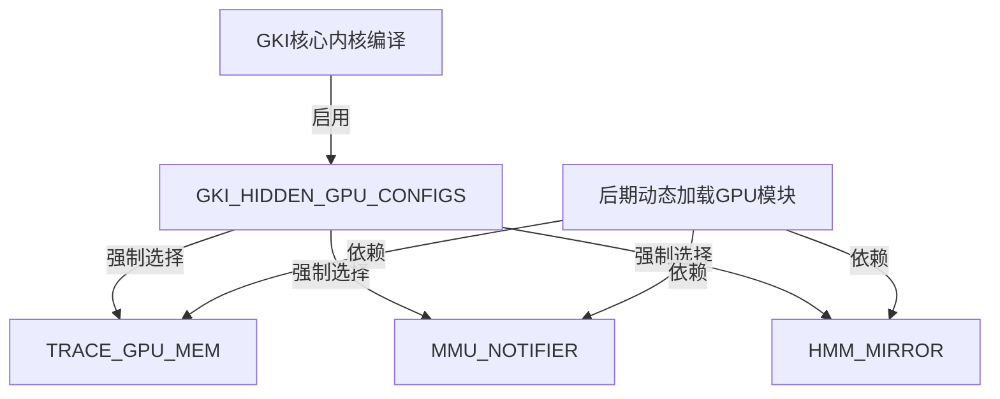

## 问题
初次编译时报错，编译输出如下
```sh
checkvintf I 06-05 18:04:10 53974 53974 HostFileSystem.cpp:54] List 'out/target/product/rk3588_RB/system_ext/etc/vintf/': OK
checkvintf I 06-05 18:04:10 53974 53974 HostFileSystem.cpp:43] Fetch 'out/target/product/rk3588_RB/system_ext/etc/vintf/manifest.xml': OK
checkvintf I 06-05 18:04:10 53974 53974 HostFileSystem.cpp:54] List 'out/target/product/rk3588_RB/product/etc/vintf/': NAME_NOT_FOUND
checkvintf I 06-05 18:04:10 53974 53974 check_vintf.cpp:384] All HALs in device manifest are declared in FCM <= level 6
checkvintf E 06-05 18:04:10 53974 53974 check_vintf.cpp:620] files are incompatible: Runtime info and framework compatibility matrix are incompatible: No compatible kernel requirement found (kernel FCM version = 6).
checkvintf E 06-05 18:04:10 53974 53974 check_vintf.cpp:620] For kernel requirements at matrix level 6, Missing config CONFIG_TRACE_GPU_MEM
checkvintf E 06-05 18:04:10 53974 53974 check_vintf.cpp:620] : Success
INCOMPATIBLE
18:04:48 ninja failed with: exit status 1

#### failed to build some targets (04:26 (mm:ss)) ####

Build android failed!
```

## 问题分析
从日志中可以看到，checkvintf工具在检查VINTF（Vendor Interface）的兼容性时，指出在框架兼容性矩阵（FCM）级别6中，要求内核配置必须包含CONFIG_TRACE_GPU_MEM，但是当前的内核配置中缺少这个配置项。

于是在对应的内核defconfig中添加`CONFIG_TRACE_GPU_MEM=y`，但编译后仍然报一样的错误，查看`kernel-5.10/.config`发现其中并没有这个选项，也就是说选项没有生效。

之前遇到的defconfig中选项不生效的问题，出现在自己添加选项时，忘记添加对应的Kconfig，但是这个选项应该是内核内置的，不应该没有对应的Kconfig，于是在内核目录下寻找：
```sh
find . -type f -name "*Kconfig*" | xargs grep -li "TRACE_GPU_MEM"

./drivers/gpu/trace/Kconfig
./init/Kconfig.gki
```

发现有两个Kconfig涉及这个选项
1. `./drivers/gpu/trace/Kconfig`
    ```Kconfig
    # SPDX-License-Identifier: GPL-2.0-only

    config TRACE_GPU_MEM
        bool
    ```
    这个Kconfig中定义了`TRACE_GPU_MEM`选项。

2. `./init/Kconfig.gki`
    ```Kconfig
    config GKI_HIDDEN_GPU_CONFIGS
        bool "Hidden GPU configuration needed for GKI"
        select TRACE_GPU_MEM
        select MMU_NOTIFIER
        select HMM_MIRROR
        help
        Dummy config option used to enable the hidden GPU config.
        These are normally selected implicitly when a module
        that relies on it is configured.
    ```
    - 而这个选项中，指出 `GKI_HIDDEN_GPU_CONFIGS` 选项依赖`TRACE_GPU_MEM`选项，help信息指出`GKI_HIDDEN_GPU_CONFIGS`是一个​​虚拟开关（dummy config）​​，目的是在启用 GKI 时，​​强制激活​​某些被 GPU 模块依赖但​​不直接暴露给用户​​的底层配置选项（如 `TRACE_GPU_MEM`, `MMU_NOTIFIER`, `HMM_MIRROR`）。

    - 在Linux内核的Kconfig系统中，使用select可以强制启用其他配置项。这个配置项`GKI_HIDDEN_GPU_CONFIGS`被设计为当用户启用它时，它会强制选择`TRACE_GPU_MEM`、`MMU_NOTIFIER`和`HMM_MIRROR`这三个配置项。



## 解决方法
在defconfig中添加`GKI_HIDDEN_GPU_CONFIGS=y`即可，编译后也可以在.config看到`TRACE_GPU_MEM`被启用了。
