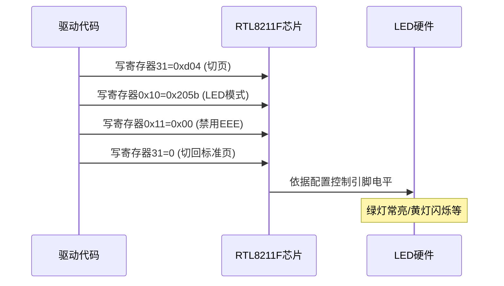

## 1 原理
### 1.1 实际效果
RJ45接口一般有左右两个Led灯，用于指示网络连接状态，实际上，一侧的灯珠位置上封装了两颗不同颜色的led灯（比如黄色和绿色）,这样这个位置就可以按需显示不同颜色的灯光。


### 1.2 电路原理
原理图上，可以看到LED灯有三个控制引脚，有两个灯珠那个位置两个灯的极性是反向的


这三个LED信号是由PHY芯片控制的，以RTL8211F为例


### 1.3 PHY寄存器配置
查看RTL8211F的datasheet
- P47: 三个信号的寄存器配置

- P27: 寄存器位说明


- P48: 信号的网口节能状态指示


- P28: 模式A的灯状态与寄存器真值表


综上，每个灯信号占用寄存器中的五位（实际4位，中间1位没有作用），根据真值表，配置每一颗LED的寄存器位即可

## 2 实战配置
### 2.1 明确需求
左灯指示网络活动，右灯在1000Mps黄灯、100Mbps绿灯、10Mbps不亮
### 2.2 计算寄存器
```
// ╔════════════╗
// ║■ ╔══════╗ ■║
// ║╔═╝      ╚═╗║
// ║║          ║║
// ║╚══════════╝║
// ╚════════════╝
```
| 位置 | LED 编号 | 数值 | 二进制值（MSB-LSB） | 模式/速率 | 状态 |
|---|---|---|---|---|---|
| 左黄 | LED 0 | 16 | 11011 | 10/100/1000 | +Active 10/100/1000 |
| 右绿 | LED 1 | 02 | 00010 | 100 |  |
| 右黄 | LED 2 | 08 | 01000 | 1000 |  |
### 2.3 修改代码
```diff
diff --git a/kernel-5.10/drivers/net/ethernet/stmicro/stmmac/stmmac_main.c b/kernel-5.10/drivers/net/ethernet/stmicro/stmmac/stmmac_main.c
index e14a682e3b..d10bc673c4 100755
--- a/kernel-5.10/drivers/net/ethernet/stmicro/stmmac/stmmac_main.c
+++ b/kernel-5.10/drivers/net/ethernet/stmicro/stmmac/stmmac_main.c
@@ -121,6 +121,14 @@ static void stmmac_exit_fs(struct net_device *dev);
 
 #define STMMAC_COAL_TIMER(x) (jiffies + usecs_to_jiffies(x))
 
+#define        LED_FIX  1
+#ifdef         LED_FIX 
+#define RTL_8201F_PHY_ID  0x001cc816
+#define RTL_8211E_PHY_ID  0x001cc915
+#define RTL_8211F_PHY_ID  0x001cc916
+#define DP_83848_PHY_ID   0x20005c90
+#endif
+
 int stmmac_bus_clks_config(struct stmmac_priv *priv, bool enabled)
 {
        int ret = 0;
@@ -4986,6 +4994,122 @@ int stmmac_reinit_ringparam(struct net_device *dev, u32 rx_size, u32 tx_size)
        return ret;
 }
 
+#ifdef LED_FIX 
+static int phy_dp83848_led_fixup(struct phy_device *phydev)
+{
+        int value;
+
+       if (phydev->phy_id != DP_83848_PHY_ID)
+               return 0;
+
+        printk("%s in\n", __func__);
+
+       value = phy_read(phydev, 0x18);
+       value &= ~(1<<2);
+       phy_write(phydev, 0x18, value);
+
+       value = phy_read(phydev, 0x19);
+       value &= ~(1<<5);
+       phy_write(phydev, 0x19, value);
+
+       return 0;
+}
+
+static int phy_rtl8201f_led_fixup(struct phy_device *phydev)
+{
+       int value;
+
+       printk("%s in\n", __func__);
+
+       /* switch to page 7 */
+       value = phy_read(phydev, 31);
+       value &= 0xff00;
+       value |= 0x0007;
+       value = phy_write(phydev, 31, value);
+
+       /* set customized led enable */
+       value = phy_read(phydev, 19);
+       value |= (0x1<<3);
+       phy_write(phydev, 19, value);
+
+       value &= 0x0000;
+       value |= (0x1<<1);
+       value |= (0x1<<7);
+       phy_write(phydev, 17, value);
+
+       /* back to page 0 */
+       value = phy_read(phydev, 31);
+       value &= 0x0000;
+       value = phy_write(phydev, 31, value);
+
+       return 0;
+}
+
+static int phy_rtl8211e_led_fixup(struct phy_device *phydev)
+{
+       int val;
+
+       printk("%s in\n", __func__);
+       val = phy_read(phydev, 3);
+       printk("%s in  val=0x%04x\n", __func__, val);
+
+       /*switch to extension page44*/
+       phy_write(phydev, 31, 0x07);
+       phy_write(phydev, 30, 0x2c);
+
+       /*set led1(yellow) act*/
+       val = phy_read(phydev, 26);
+       val &= (~(1<<4));// bit4=0
+       val |= (1<<5);// bit5=1
+       val &= (~(1<<6));// bit6=0
+       phy_write(phydev, 26, val);
+
+       /*set led0(green) link*/
+       val = phy_read(phydev, 28);
+       val |= (7<<0);// bit0,1,2=1
+       val &= (~(7<<4));// bit4,5,6=0
+       val &= (~(7<<8));// bit8,9,10=0
+       phy_write(phydev, 28, val);
+
+       /*switch back to page0*/
+       phy_write(phydev,31,0x00);
+
+       return 0;
+}
+
+// ╔════════════╗
+// ║■ ╔══════╗ ■║
+// ║╔═╝      ╚═╗║
+// ║║          ║║
+// ║╚══════════╝║
+// ╚════════════╝
+#define L_YELLOW_LED   0       //左黄灯
+#define R_GREEN_LED    1       //右绿灯
+#define R_YELLOW_LED   2       //右黄灯
+
+static int phy_rtl8211f_led_fixup(struct phy_device *phydev)
+{
+       unsigned int temp;
+
+       printk("[Witheart] test eth led ctrl start(kernel-5.10/drivers/net/ethernet/stmicro/stmmac/stmmac_main.c)====== %s\n",__FUNCTION__);
+       if(!phydev) return -1;
+       if(phydev->phy_id!=0x001cc916) return -1; /* only for 8211E*/
+
+       // 配置网口LED灯
+       phy_write(phydev, 31, 0xd04); //选择页d04
+       temp = 0x02 << (5 * R_GREEN_LED); //右绿灯表示百兆
+       temp |= 0x08 << (5 * R_YELLOW_LED); //右黄灯表示千兆
+       temp |= 0x1b << (5 * L_YELLOW_LED); //左黄灯表示数据包收发状态
+       phy_write(phydev, 0x10, temp); //写入LED配置寄存器
+       phy_write(phydev, 0x11, 0x00); //关闭EEE节能状态指示
+       phy_write(phydev, 31, 0); //选择页0
+
+       printk("[Witheart] test eth led ctrl end====== %s\n",__FUNCTION__);
+
+       return 0;
+}
+#endif
+
 /**
  * stmmac_dvr_probe
  * @device: device pointer
@@ -5219,6 +5343,22 @@ int stmmac_dvr_probe(struct device *device,
                goto error_netdev_register;
        }
 
+#ifdef LED_FIX 
+/* register the PHY board fixup */
+ret = phy_register_fixup_for_uid(RTL_8211E_PHY_ID, 0xffffffff, phy_rtl8211e_led_fixup);
+if (ret)
+       pr_warn("Cannot register PHY board fixup.\n");
+ret = phy_register_fixup_for_uid(RTL_8211F_PHY_ID, 0xffffffff, phy_rtl8211f_led_fixup);
+if (ret)
+       pr_warn("Cannot register PHY board fixup.\n");
+ret = phy_register_fixup_for_uid(RTL_8201F_PHY_ID, 0xffffffff, phy_rtl8201f_led_fixup);
+if (ret)
+       pr_warn("Cannot register PHY board fixup.\n");
+ret = phy_register_fixup_for_uid(DP_83848_PHY_ID, 0xffffffff, phy_dp83848_led_fixup);
+if (ret)
+       pr_warn("Cannot register PHY board fixup.\n");
+#endif
+
 #ifdef CONFIG_DEBUG_FS
        stmmac_init_fs(ndev);
 #endif
```


