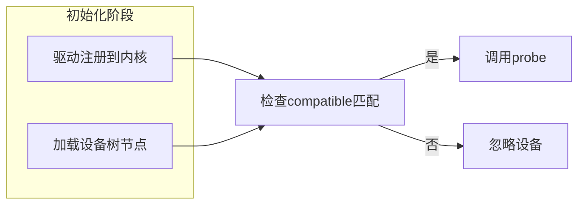
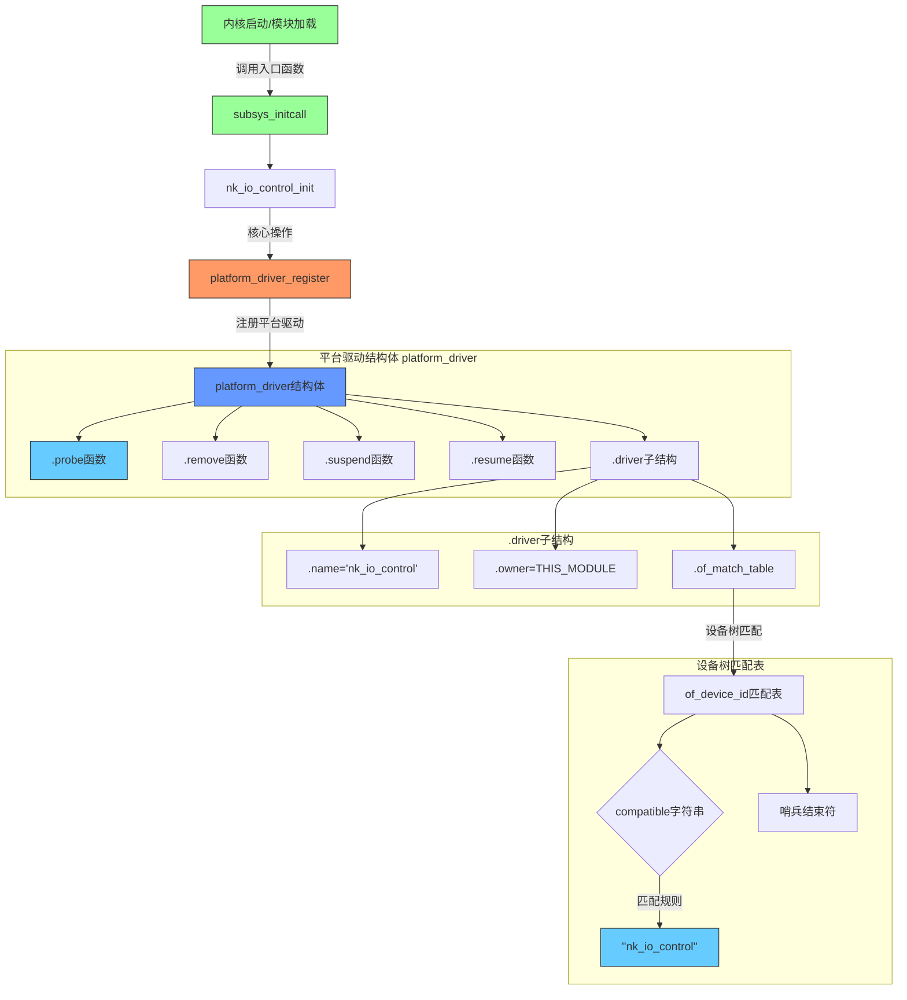

本文通过流程图和代码示例，详细介绍了Linux驱动开发的加载流程和基本驱动骨架，包括驱动注册、设备匹配、probe函数调用等关键步骤，以及驱动结构体的各个组成部分和作用。


## 1 加载流程


### 1.1 **驱动注册 (`platform_driver_register`)**  
   - **目的**： 告诉内核：“我（这个驱动）已经准备好服务了”。  
   - **操作**：  
     ```c  
     platform_driver_register(&nk_io_control_driver);  
     ```  
   - **效果**：  
     - 驱动结构体（包含 `.name`, `.of_match_table` 等）被注册到内核的 **平台总线 (`platform_bus_type`)** 上。  
     - 驱动进入内核的驱动列表（可通过 `/sys/bus/platform/drivers/` 查看）。

### 1.2 **设备匹配**  
   - **时机**（**两者之一**触发）：  
     - **情况1**： **设备树节点已存在**  
       当驱动注册时，内核 *立即* 扫描设备树，查找所有与 `of_match_table`（即 `"nk_io_control"`）**兼容**的设备节点。  
     - **情况2**： **设备树节点后添加**  
       如果设备树节点是在驱动 *之后* 加载或创建（如通过动态设备树 overlay），内核在该节点被加载时会扫描 *所有已注册的驱动*，寻找匹配项。  
   - **匹配依据**：  
     - 设备树节点的 `compatible` 属性与驱动 `of_match_table` 中的 `compatible` 字符串一致。

### 1.3 **调用 `probe` 函数**  
   - **时机**： **当匹配成功时（**上一步的结果）。  
   - **动作**：  
     内核调用驱动结构体中注册的 `.probe` 函数（即 `nk_io_control_probe`）。  
   - **传入参数**：  
     `.probe` 函数通常接收一个 `struct platform_device *` 参数，包含匹配到的设备信息（资源、中断号、配置等）。  
   - **作用**： 这是**驱动初始化的核心**，驱动开发者在此完成：  
     - 硬件资源申请（IO内存/端口、中断、DMA等）  
     - 设备数据结构初始化  
     - 注册字符设备、块设备或网络设备接口  
     - 硬件初始化配置  

### 📌 关键总结
- **驱动注册 != 调用 probe**： `platform_driver_register()` 仅仅是注册驱动本身，**不保证**立刻触发设备匹配或调用 `probe`。  
- **匹配是触发的条件**： `probe` 的调用 **依赖** 于：  
  1. 驱动已被注册  
  2. 一个兼容的设备（通过设备树声明）被内核发现（无论先于驱动还是后于驱动）  
- **分离的优势**：这种设计解耦了驱动和设备，使内核可以：  
  - 动态加载/卸载驱动模块  
  - 支持热插拔设备  
  - 通过设备树灵活描述硬件，无需修改驱动源码  

## 2 基本驱动骨架

以下代码构建了 Linux 驱动的核心骨架，各组件协同工作实现设备的初始化和生命周期管理：

```c
// 模块初始化入口：声明为系统子系统初始化阶段
subsys_initcall(nk_io_control_init);

static int __init nk_io_control_init(void)
{
    platform_driver_register(&nk_io_control_driver); // 关键：注册驱动到平台总线
    return 0;
}

// 驱动核心结构体：定义驱动能力与操作接口
static struct platform_driver nk_io_control_driver = {
    .probe    = nk_io_control_probe,    // 设备匹配时自动调用的初始化入口
    .remove   = nk_io_control_remove,   // 设备移除/驱动卸载时的清理函数
    .resume   = nk_io_control_resume,   // 系统休眠唤醒后的恢复操作
    .suspend  = nk_io_control_suspend,  // 系统休眠前的设备冻结操作
    .driver   = {
        .name           = "nk_io_control",  // 驱动标识名（需确保唯一）
        .owner          = THIS_MODULE,     // 所属模块，用于引用计数管理
        .of_match_table = of_match_ptr(nk_io_control_of_match), // 设备树匹配表指针
    },
};

// 设备树匹配表：声明驱动兼容的设备标识符
static const struct of_device_id nk_io_control_of_match[] = {
    { .compatible = "nk_io_control", },  // 需与设备树节点的 compatible 属性一致
    {},  // 哨兵结束符（必不可少！）
};
MODULE_DEVICE_TABLE(of, nk_io_control_of_match);  // 将匹配表暴露给模块系统

// 设备初始化入口函数（框架）
static int nk_io_control_probe(struct platform_device *pdev)
{
    /* 
    核心功能实现位置：
    1. 获取设备资源（寄存器基地址、中断号等）
    2. 初始化硬件控制器/寄存器
    3. 注册字符设备/创建 sysfs 接口
    4. 申请所需资源（内存、中断处理等）
    */
}
```

---

### **📌 2.1 驱动注册 (`subsys_initcall` + `platform_driver_register`)**
- **`subsys_initcall`**  
  指定驱动在内核子系统初始化阶段加载（早于普通模块），确保核心硬件可用性。
- **`platform_driver_register()`**  
  将 `nk_io_control_driver` 注册到平台总线，激活设备匹配机制。此时：
  - 驱动名称（`"nk_io_control"`）写入 `/sys/bus/platform/drivers/`
  - 设备树扫描自动触发（匹配 `.of_match_table`）

### **🔧 2.2 平台驱动结构体 (`platform_driver`)**
- **`.probe`**  
  匹配成功时由内核调用，传入 `platform_device*` 包含设备资源（**驱动核心入口**）
- **`.remove/.suspend/.resume`**  
  生命周期管理三元组：
  | 函数              | 触发场景                     | 典型操作                     |
  |-------------------|------------------------------|------------------------------|
  | `remove()`        | 设备移除/驱动卸载             | 释放资源、注销设备           |
  | `suspend()`       | 系统休眠（如待机）           | 保存状态、降低功耗           |
  | `resume()`        | 系统唤醒                     | 恢复状态、重新初始化硬件     |
- **`.driver` 子结构**  
  - `name`: 总线下唯一标识符（**不能与其它驱动重复**）
  - `owner`: 固定为 `THIS_MODULE`，防止模块卸载时资源冲突
  - `of_match_table`: 指向设备树匹配表（下文详解）

### **🌳 2.3 设备树匹配表 (`of_device_id`)**
- **匹配原理**  
  设备树节点的 `compatible` 属性需包含 `"nk_io_control"` 才能触发 `.probe()`。
  ```dts
  // 设备树示例（必须存在以下节点）
  nk_control: nk_io_control@2000000 {
      compatible = "nk_io_control";  // 与此处一致
      reg = <0x2000000 0x1000>;     // 寄存器地址范围
      interrupts = <0 45 4>;         // 中断配置
  };
  ```
- **哨兵结束符 `{}`**  
  明确标识数组结束，避免内核越界访问（**务必保留**）。
- **`MODULE_DEVICE_TABLE`**  
  自动生成设备ID信息到模块文件，使热插拔加载/卸载成为可能。

### **⚙️ 2.4 Probe 函数框架**
- **参数 `pdev`**  
  包含从设备树解析的完整资源（通过 `platform_get_resource()` 等 API 获取）：
  ```c
  // 资源获取示例
  struct resource *res = platform_get_resource(pdev, IORESOURCE_MEM, 0);  // 内存资源
  int irq_num = platform_get_irq(pdev, 0);                                 // 中断号
  ```
- **典型操作链**  
  1. **设备初始化**： 重置硬件、配置寄存器默认值  
  2. **资源申请**： `request_mem_region()` + `ioremap()`（物理地址→虚拟地址）  
  3. **接口注册**：  
     - 字符设备：`alloc_chrdev_region()` + `cdev_init()` + `cdev_add()`  
     - SysFS：`device_create_file()` 或 `sysfs_create_group()`  
  4. **中断配置**（如需要）：`request_irq()` + 中断处理函数
