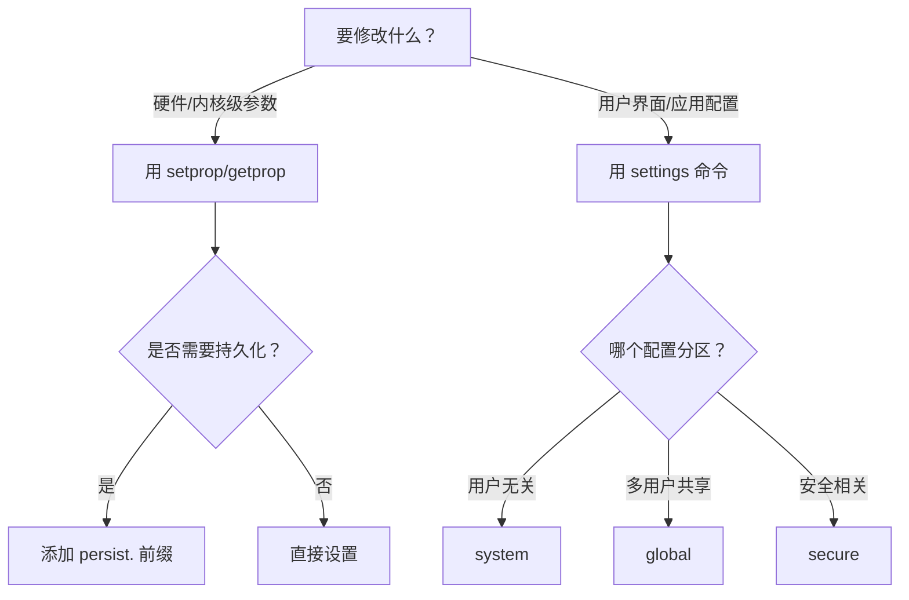

深入探索 Android 的两个核心机制：**系统属性(System Properties)** 和 **设置数据库(Settings Database)**。


## 1 架构层面的根本区别

### 1.1 系统属性 (System Properties)
- **本质**：Linux 内核级的键值对存储
- **存储位置**：RAM 内存中的特殊区域 (`/dev/__properties__`)
- **管理机制**：由 `init` 进程通过 `property_service` 管理
- **生命周期**：
  - 临时属性：进程结束即消失
  - 持久属性：写入 `/data/property/`，但**与Android设置系统无关**
- **访问方式**：
  - C/C++：`property_get()`/`property_set()`
  - Java：`System.getProperty()`/`System.setProperty()`
  - Shell：`getprop`/`setprop`

### 1.2 设置数据库 (Settings System)
- **本质**：Android应用层设置系统
- **存储位置**：
  ```mermaid
  graph TD
    A[SettingsProvider] --> B[(SQLite数据库)]
    B --> C[/data/system/users/0/settings_system.xml/]
    B --> D[/data/system/users/0/settings_global.xml/]
    B --> E[/data/system/users/0/settings_secure.xml/]
  ```
- **管理机制**：由 `SettingsProvider` 系统应用管理
- **访问方式**：
  - Java：`Settings.System.getInt()` 等
  - ADB：`settings` 命令
  - ContentResolver：`content://settings/...`

## 2 详细功能对比

| 特性 | `setprop` | `settings put` |
|------|-----------|----------------|
| **存储位置** | 内核内存区域 | SQLite数据库文件 |
| **持久性** | 重启后消失* | 永久保存 |
| **访问权限** | 所有进程可见 | 需要特定权限 |
| **变更通知** | 通过property_changed | 通过ContentObserver |
| **Java访问API** | System.getProperty() | Settings.System.getInt() |
| **数据类型** | 仅字符串 | int, string, float, long |
| **作用域** | 全局所有进程 | 用户/应用特定 |
| **恢复出厂** | 不会清除 | 会被清除 |

> *以`persist.`开头的属性可以持久化，但存储在不同的位置

## 3 通过实验验证差别

让我们在设备上进行实际测试：

```bash
# 1. 用setprop设置"伪设置"
adb shell setprop sys.test_settings_example 1

# 2. 用settings设置真实设置
adb shell settings put system test_settings_example 1

# 3. 检查属性存在性
adb shell getprop | grep test_settings_example
# 输出: [sys.test_settings_example]: [1]

# 4. 检查设置存在性
adb shell settings get system test_settings_example
# 输出: 1

# 5. 查找实际存储位置
adb shell grep test_settings /data/system/users/0/settings_system.xml
# 输出: <setting id="XX" name="test_settings_example" value="1" />
```

## 4 操作命令
### 4.1 系统属性
- 操作命令

| 命令 | 功能 | 示例 |
|------|------|------|
| `setprop <key> <value>` | 设置属性 | `adb shell setprop debug.choreographer.skip 1` |
| `getprop <key>` | 读取属性 | `adb shell getprop ro.build.version` |
| `getprop` | 列出所有属性 | `adb shell getprop \| grep "ro."` |

- 属性类别

| 前缀 | 含义 | 典型示例 |
|------|------|----------|
| `ro.` | 只读属性 (只可初始化设置) | `ro.product.model` |
| `persist.` | 持久化属性 | `persist.sys.timezone` |
| `sys.` | 系统运行时状态 | `sys.boot_completed` |
| `ctl.` | 控制服务启停 | `ctl.start servicename` |

### 4.2 系统设置
- 设置类别

| 分区 | 存储路径 | 适合场景 |
|------|----------|----------|
| **System** | `/data/system/users/0/settings_system.xml` | 系统界面、声音等用户无关设置 |
| **Secure** | `/data/system/users/0/settings_secure.xml` | 安全敏感配置（如位置权限） |
| **Global** | `/data/system/users/0/settings_global.xml` | 多用户共享的全局设置 |

- 操作命令
```bash
# 语法结构：
adb shell settings [put/get/delete] [system|secure|global] <key> <value>
```

| 操作 | 示例命令 | 功能 |
|------|----------|------|
| **写入设置** | `settings put system screen_brightness 50` | 设置屏幕亮度50% |
| **读取设置** | `settings get system auto_rotate` | 检查自动旋转开关 |
| **删除设置** | `settings delete secure bluetooth_address` | 清除蓝牙地址 |
| **列表输出** | `settings list system` | 列出所有system分区设置 |

## 5 修改决策


## 6 代码分析 
> - 看到代码中 `Settings.System.getInt()` → 用 `settings put system`  
> - 看到 `System.getProperty()` → 用 `setprop`  
