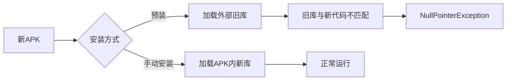

## 问题描述
更新厂测apk时，发现使用adb 或者 u盘手动安装apk，则运行一切正常，但是预装到系统中，则运行报错，具体表现为应用可打开，但是某些操作后触发闪退，或者是运行不正常，比如不能正确获取mac、SN等。

- 部分问题的logcat日志
```logcat
java.lang.NullPointerException: Attempt to invoke virtual method 'java.lang.String android.content.Context.getPackageName()' on a null object reference
08-02 10:18:36.159  3061  3061 E AndroidRuntime:        at android.app.ActivityThread.performLaunchActivity(ActivityThread.java:3431)
08-02 10:18:36.159  3061  3061 E AndroidRuntime:        at android.app.ActivityThread.handleLaunchActivity(ActivityThread.java:3595)
08-02 10:18:36.159  3061  3061 E AndroidRuntime:        at android.app.servertransaction.LaunchActivityItem.execute(LaunchActivityItem.java:85)
08-02 10:18:36.159  3061  3061 E AndroidRuntime:        at android.app.servertransaction.TransactionExecutor.executeCallbacks(TransactionExecutor.java:135)
08-02 10:18:36.159  3061  3061 E AndroidRuntime:        at android.app.servertransaction.TransactionExecutor.execute(TransactionExecutor.java:95)
08-02 10:18:36.159  3061  3061 E AndroidRuntime:        at android.app.ActivityThread$H.handleMessage(ActivityThread.java:2066)
08-02 10:18:36.159  3061  3061 E AndroidRuntime:        at android.os.Handler.dispatchMessage(Handler.java:106)
08-02 10:18:36.159  3061  3061 E AndroidRuntime:        at android.os.Looper.loop(Looper.java:223)
08-02 10:18:36.159  3061  3061 E AndroidRuntime:        at android.app.ActivityThread.main(ActivityThread.java:7664)
08-02 10:18:36.159  3061  3061 E AndroidRuntime:        at java.lang.reflect.Method.invoke(Native Method)
08-02 10:18:36.159  3061  3061 E AndroidRuntime:        at com.android.internal.os.RuntimeInit$MethodAndArgsCaller.run(RuntimeInit.java:592)
08-02 10:18:36.159  3061  3061 E AndroidRuntime:        at com.android.internal.os.ZygoteInit.main(ZygoteInit.java:947)
08-02 10:18:36.159  3061  3061 E AndroidRuntime: Caused by: java.lang.NullPointerException: Attempt to invoke virtual method 'java.lang.String android.content.Context.getP
ackageName()' on a null object reference
08-02 10:18:36.159  3061  3061 E AndroidRuntime:        at android.widget.Toast.<init>(Toast.java:167)
08-02 10:18:36.159  3061  3061 E AndroidRuntime:        at android.widget.Toast.makeText(Toast.java:492)
08-02 10:18:36.159  3061  3061 E AndroidRuntime:        at android.widget.Toast.makeText(Toast.java:480)
08-02 10:18:36.159  3061  3061 E AndroidRuntime:        at com.hc.android_test.ReadSnMac.ReadMac1(ReadSnMac.java:38)
08-02 10:18:36.159  3061  3061 E AndroidRuntime:        at com.hc.android_test.TestActivity.read_man_sn(TestActivity.java:475)
08-02 10:18:36.159  3061  3061 E AndroidRuntime:        at com.hc.android_test.TestActivity.onCreate(TestActivity.java:92)
08-02 10:18:36.159  3061  3061 E AndroidRuntime:        at android.app.Activity.performCreate(Activity.java:8013)
08-02 10:18:36.159  3061  3061 E AndroidRuntime:        at android.app.Activity.performCreate(Activity.java:7997)
08-02 10:18:36.159  3061  3061 E AndroidRuntime:        at android.app.Instrumentation.callActivityOnCreate(Instrumentation.java:1309)
08-02 10:18:36.159  3061  3061 E AndroidRuntime:        at android.app.ActivityThread.performLaunchActivity(ActivityThread.java:3404)
08-02 10:18:36.159  3061  3061 E AndroidRuntime:        ... 11 more
08-02 10:18:36.162   457  3108 I DropBoxManagerService: add tag=data_app_crash isTagEnabled=true flags=0x2
08-02 10:18:36.163   457  2611 W ActivityTaskManager:   Force finishing activity com.hc.android_test/.TestActivity

```

看起来像是无法获取包名导致的npe错误，但实际上，还发生了更诡异的事情，我的代码中将一些日志打印删除后重新编译，且寻找整个工程后也没有类似的日志打印代码，但是，在预装版本的apk运行时，仍有这些日志打印，而手动安装的版本就没有任何问题。读者可能会猜测，是预装时版本没有正确更新导致的，但是笔者可以确定，从软件界面已经改变的证据看，版本肯定更新了。

## 问题解决
- 后面发现是预装软件时，对应的库没有更新导致的，具体为vendor/rockchip/common/apps/TestTool_Singleeth/lib/arm64下的库
- vendor/rockchip/common/apps/TestTool_Singleeth/Android.mk
```makefile
LOCAL_PATH := $(my-dir)

include $(CLEAR_VARS)
LOCAL_MODULE := TestTool_Singleeth
LOCAL_MODULE_CLASS := APPS
LOCAL_MODULE_PATH := $(TARGET_OUT_ODM)/bundled_uninstall_back-app
LOCAL_SRC_FILES := $(LOCAL_MODULE)$(COMMON_ANDROID_PACKAGE_SUFFIX)
LOCAL_CERTIFICATE := platform
#LOCAL_DEX_PREOPT := false
LOCAL_MODULE_TAGS := optional
LOCAL_MODULE_SUFFIX := $(COMMON_ANDROID_PACKAGE_SUFFIX)
LOCAL_JNI_SHARED_LIBRARIES_ABI := arm64
MY_LOCAL_PREBUILT_JNI_LIBS := \
	lib/arm64/libserial_port.so\
	lib/arm64/libandroid_test_zl.so\

MY_APP_LIB_PATH := $(TARGET_OUT_ODM)/bundled_uninstall_back-app/$(LOCAL_MODULE)/lib/$(LOCAL_JNI_SHARED_LIBRARIES_ABI)
ifneq ($(LOCAL_JNI_SHARED_LIBRARIES_ABI), None)
$(warning MY_APP_LIB_PATH=$(MY_APP_LIB_PATH))
LOCAL_POST_INSTALL_CMD :=     mkdir -p $(MY_APP_LIB_PATH)     $(foreach lib, $(MY_LOCAL_PREBUILT_JNI_LIBS), ; cp -f $(LOCAL_PATH)/$(lib) $(MY_APP_LIB_PATH)/$(notdir $(lib)))
endif
include $(BUILD_PREBUILT)

```
- **使用apktool对apk进行解包，然后将库更新到sdk中，重新编译，问题解决**

## 原理分析
- 因为是库没有更新导致的问题，这很好地解释了为什么手动安装软件不会出问题，而预装软件就会报错。因为手动安装软件不用指定库，根本不存在库没有更新的问题。
- 但是新的问题是，更新的库也是从apk中解包出来的，为什么预装时要指定库，导致出现这些问题呢？

### 核心问题分析
1. **库文件未同步更新**
   - 预装机制（`Android.mk`）中指定了专门的JNI库路径：`vendor/rockchip/common/apps/TestTool_Singleeth/lib/arm64`
   - 当更新APK时，如果**只替换了APK文件**，但未更新对应的`.so`库文件，系统仍会加载旧版库
   - 例如：
     ```makefile
     MY_LOCAL_PREBUILT_JNI_LIBRARIES := lib/arm64/libserial_port.so
     ```
     该路径的库文件未随APK更新

2. **手动安装与预装的本质区别**
   | 安装方式       | 库加载路径                     | 是否受影响 |
   |----------------|--------------------------------|------------|
   | 手动安装(adb/U盘) | 从APK内部`/lib`目录自动解压     | ✔️ 正常     |
   | 系统预装        | 从`Android.mk`指定的外部路径加载 | ✘ 故障     |

### 根本原因图解


> **结论**：预装APK需要同时更新APK文件和`Android.mk`指定的JNI库路径（特别是`.so`文件）。
