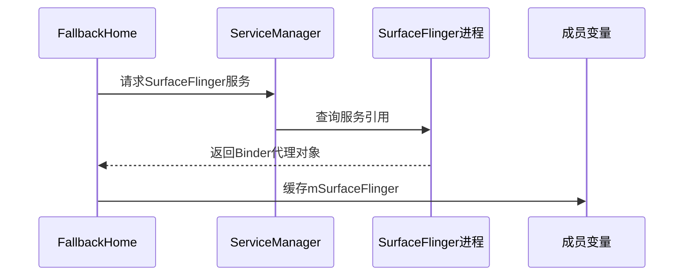
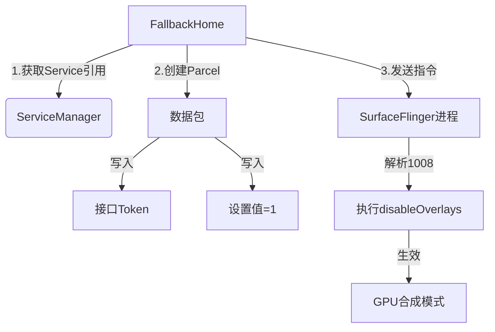

## 1 参考链接

[https://blog.csdn.net/DKBDKBDKB/article/details/128890747](https://blog.csdn.net/DKBDKBDKB/article/details/128890747)

## 2 问题背景

- rk3588
- Android13
- 客户的 apk(云从科技的活体/人脸检测相机“中间件演示 Demo”)运行时黑屏，具体表现为界面更新显示时，LVDS 会短暂黑屏后恢复，而 HDMI 则全程绿屏

报错：屏幕缓冲区中无数据

```bash
[  873.755970][    C0] vop2_isr: 855237 callbacks suppressed
[  873.755987][    C0] rockchip-vop2 fdd90000.vop: [drm:vop2_isr] *ERROR* POST_BUF_EMPTY irq err at vp1
[  873.756129][    C0] rockchip-vop2 fdd90000.vop: [drm:vop2_isr] *ERROR* POST_BUF_EMPTY irq err at vp1
[  873.756154][    C0] rockchip-vop2 fdd90000.vop: [drm:vop2_isr] *ERROR* POST_BUF_EMPTY irq err at vp1
[  873.756177][    C0] rockchip-vop2 fdd90000.vop: [drm:vop2_isr] *ERROR* POST_BUF_EMPTY irq err at vp1
[  873.756199][    C0] rockchip-vop2 fdd90000.vop: [drm:vop2_isr] *ERROR* POST_BUF_EMPTY irq err at vp1
[  873.756222][    C0] rockchip-vop2 fdd90000.vop: [drm:vop2_isr] *ERROR* POST_BUF_EMPTY irq err at vp1
[  873.756246][    C0] rockchip-vop2 fdd90000.vop: [drm:vop2_isr] *ERROR* POST_BUF_EMPTY irq err at vp1
[  873.756278][    C0] rockchip-vop2 fdd90000.vop: [drm:vop2_isr] *ERROR* POST_BUF_EMPTY irq err at vp1
[  873.756300][    C0] rockchip-vop2 fdd90000.vop: [drm:vROR* POST_BUF_EMPTY irq err at vp1
[  873.756321][    C0] rockcdrm:vop2_isr] *ERROR* POST_BUF_EMPTY irq err at vp1
```

## 3 问题解决

打开开发者选项中的“停用 HW 叠加层”，强制 GPU 渲染。

- 手动打开可临时解决，但是这个选项打开后，每次重启都会自动关闭，使用不方便，故需要在每次开机时默认打开

### 3.1 patch

```diff
diff --git a/packages/apps/Settings/src/com/android/settings/FallbackHome.java b/packages/apps/Settings/src/com/android/settings/FallbackHome.java
index b70470b531..1eeb458b1e 100644
--- a/packages/apps/Settings/src/com/android/settings/FallbackHome.java
+++ b/packages/apps/Settings/src/com/android/settings/FallbackHome.java
@@ -17,6 +17,7 @@
 package com.android.settings;

 import android.app.Activity;
+import android.app.AppGlobals;
 import android.app.WallpaperColors;
 import android.app.WallpaperManager;
 import android.app.WallpaperManager.OnColorsChangedListener;
@@ -25,7 +26,12 @@ import android.content.Context;
 import android.content.Intent;
 import android.content.IntentFilter;
 import android.content.pm.ResolveInfo;
+import android.content.pm.IPackageManager;
 import android.os.AsyncTask;
+import android.os.IBinder;
+import android.os.Parcel;
+import android.os.RemoteException;
+import android.os.ServiceManager;
 import android.os.Bundle;
 import android.os.Handler;
 import android.os.Message;
@@ -47,6 +53,13 @@ public class FallbackHome extends Activity {
     private boolean mProvisioned;
     private WallpaperManager mWallManager;

+    private static final int SETTING_VALUE_ON = 1;
+    private static final String SURFACE_FLINGER_SERVICE_KEY = "SurfaceFlinger";
+    private static final String SURFACE_COMPOSER_INTERFACE_KEY = "android.ui.ISurfaceComposer";
+    private static final int SURFACE_FLINGER_DISABLE_OVERLAYS_CODE = 1008;
+
+       private static IBinder mSurfaceFlinger;
+
     private final Runnable mProgressTimeoutRunnable = () -> {
         View v = getLayoutInflater().inflate(
                 R.layout.fallback_home_finishing_boot, null /* root */);
@@ -105,10 +118,37 @@ public class FallbackHome extends Activity {
         }
         getWindow().getDecorView().setSystemUiVisibility(flags);

+        if (mSurfaceFlinger == null) {
+            mSurfaceFlinger = ServiceManager.getService(SURFACE_FLINGER_SERVICE_KEY);
+        }
+
+        initHardwareOverlaysSetting(SETTING_VALUE_ON);
+
         registerReceiver(mReceiver, new IntentFilter(Intent.ACTION_USER_UNLOCKED));
         maybeFinish();
     }

+    public void initHardwareOverlaysSetting(int val) {
+        if (mSurfaceFlinger == null) {
+            return;
+        }
+
+        IPackageManager pm = AppGlobals.getPackageManager();
+        // magic communication with surface flinger.
+        try {
+            // if (pm.isFirstBoot()) {//首次启动时强制设置
+            //每次启动都强制设置开发者选项中的“停用HW叠加层”
+                final Parcel data = Parcel.obtain();
+                data.writeInterfaceToken(SURFACE_COMPOSER_INTERFACE_KEY);
+                data.writeInt(val);
+                mSurfaceFlinger.transact(SURFACE_FLINGER_DISABLE_OVERLAYS_CODE, data, null, 0 /* flags */);
+                data.recycle();
+            // }
+        } catch (RemoteException ex) {
+            // intentional no-op
+        }
+    }
+
     @Override
     protected void onResume() {
         super.onResume();
```

## 4 实现方案分析

### 4.1 为什么选择`FallbackHome`类？

1. **FallbackHome 的作用**：

   - Android 启动过程中在 Launcher（桌面应用）加载前显示的**临时过渡界面**
   - 系统必经启动路径，确保修改在用户看到桌面**前生效**

2. **不可用方案**：
   - 开发者选项控制类`DevelopmentSettings`：仅在用户手动打开开发者选项时加载
   - Launcher 相关类：部分设备可能有定制 Launcher，路径不可控

### 4.2 系统框架示意图：

```
Boot Sequence（启动序列）：
[Bootloader] → [Kernel] → [Init] → [Zygote] → [SystemServer] → [FallbackHome] → [Launcher]
                                                                  修改点→↑
```

## 5 关键术语解析

### 5.1 HWC (Hardware Composer)
- **作用**：Android显示系统的硬件抽象层
- **职责**：
  - 管理屏幕的图层合成
  - 协调GPU和显示硬件的协作
- **优化效果**：
  - 降低GPU负载 → 减少功耗
  - 提升合成效率 → 更流畅的UI

### 5.2 HW叠加层 (Hardware Overlays)
- **原理**：将不同UI元素（状态栏/导航栏/应用窗口）作为独立图层，由**显示硬件直接合成**
- **禁用效果**：
  ```mermaid
  graph LR
  A[图层1] --> B[图层2]
  B --> C[图层3]
  C -->|HWC模式| D[显示硬件合成]
  C -->|禁用HWC| E[GPU统一渲染<br>-->合成位图] --> D
  ```

### 5.3 SurfaceFlinger
- **定位**：Android显示系统的核心服务
- **核心能力**：
  - 接收所有应用的绘图缓冲区
  - 通过HWC或GPU合成最终画面
- **通信机制**：Binder IPC（跨进程通信）

### 5.4 Binder IPC机制
```mermaid
sequenceDiagram
  FallbackHome->>SurfaceFlinger： 构建Parcel数据包
  Note right of FallbackHome： 包含接口标识+参数值
  SurfaceFlinger-->>FallbackHome： 执行transact()
  SurfaceFlinger->>HWC： disableOverlays(val)
```

### 5.5 Parcel数据容器
- **作用**：进程间通信的数据载体
- **操作特点**：
  - 顺序化写入/读取
  - 支持基础类型和Binder对象
- **典型生命周期**：
  ```java
  Parcel data = Parcel.obtain(); // 从对象池获取
  data.writeInt(1);             // 写入数据
  binder.transact(..., data);   // 传输数据
  data.recycle();               // 放回对象池
  ```

## 6 代码修改与原理关联说明
### 6.1 修改点1：导入新增类库
```java
+import android.app.AppGlobals;
+import android.content.pm.IPackageManager;
+import android.os.IBinder;
+import android.os.Parcel;
+import android.os.RemoteException;
+import android.os.ServiceManager;
```
**为什么需要这些？**
- **IBinder/Parcel**：实现跨进程通信的核心组件
- **RemoteException**：处理IPC可能发生的通信错误
- **ServiceManager**：获取系统核心服务的钥匙
- **IPackageManager**：检测系统是否首次启动（避免覆盖用户后续修改）

**底层原理**：
Android系统的显示服务运行在独立进程，必须通过Binder IPC机制与其通信

---

### 6.2 修改点2：定义通信常量
```java
+    private static final int SETTING_VALUE_ON = 1;
+    private static final String SURFACE_FLINGER_SERVICE_KEY = "SurfaceFlinger";
+    private static final String SURFACE_COMPOSER_INTERFACE_KEY = "android.ui.ISurfaceComposer";
+    private static final int SURFACE_FLINGER_DISABLE_OVERLAYS_CODE = 1008;
+    private static IBinder mSurfaceFlinger;
```
**各常量的作用**：
1. `SETTING_VALUE_ON` → 表示"开启"状态的标志值
2. `SURFACE_FLINGER_SERVICE_KEY` → 在ServiceManager中查找显示服务的密钥
3. `SURFACE_COMPOSER_INTERFACE_KEY` → IPC接口标识符（类似身份凭证）
4. `SURFACE_FLINGER_DISABLE_OVERLAYS_CODE` → SurfaceFlinger内部的操作码

**为什么需要1008？**
这是SurfaceFlinger服务内部方法的唯一ID，用于识别要调用的具体函数

---

### 6.3 修改点3：获取SurfaceFlinger服务
```java
+        if (mSurfaceFlinger == null) {
+            mSurfaceFlinger = ServiceManager.getService(SURFACE_FLINGER_SERVICE_KEY);
+        }
```
**流程解析**：


**为什么要缓存？**
避免每次调用都重新查询服务，提升性能

---

### 6.4 修改点4：核心功能实现
```java
+        initHardwareOverlaysSetting(SETTING_VALUE_ON);
```

```java
+    public void initHardwareOverlaysSetting(int val) {
+        if (mSurfaceFlinger == null) return;
+
+        IPackageManager pm = AppGlobals.getPackageManager();
+        try {
+            if (pm.isFirstBoot()) {
+                final Parcel data = Parcel.obtain();
+                data.writeInterfaceToken(SURFACE_COMPOSER_INTERFACE_KEY);
+                data.writeInt(val);
+                mSurfaceFlinger.transact(
+                   SURFACE_FLINGER_DISABLE_OVERLAYS_CODE, 
+                   data, 
+                   null, 
+                   0
+                );
+                data.recycle();
+            }
```

**逐行解析**：
1. **pm.isFirstBoot()** → 只在新设备首次启动时执行(去掉该条件判断则每次开机都执行)
   
2. **Parcel data = Parcel.obtain()** → 创建通信信封
   - Parcel是Android的IPC数据传输容器

3. **writeInterfaceToken()** → 写入接口标识
   - 相当于在信封上写收件人地址
   - 必须是`android.ui.ISurfaceComposer`这个固定值

4. **writeInt(val)** → 写入设置值
   - 此处传入`SETTING_VALUE_ON(1)`表示开启

5. **transact()** → 执行跨进程调用
   ```java
   mSurfaceFlinger.transact(
       1008,       // 方法ID：禁用叠加层
       data,       // 包含设置值的信封
       null,       // 不需要返回结果
       0           // 同步调用标志
   );
   ```

6. **data.recycle()** → 重要！
   - Parcel对象需手动回收，否则导致内存泄漏
   - 类似C++中的delete操作

---

### 6.5 通信过程全解析（重点）


1. **数据包结构**：
   ```
   ┌──────────────────┐
   │ Interface Token  │ → 身份验证字符串
   ├──────────────────┤
   │     int = 1      │ → 启用标志
   └──────────────────┘
   ```

2. **SurfaceFlinger内部处理**：
   ```cpp
   // SurfaceFlinger服务端代码（伪代码）
   case 1008: {
       // 1. 验证接口Token
       CHECK_INTERFACE(ISurfaceComposer, data);
       
       // 2. 读取设置值
       int flag = data.readInt();
       
       // 3. 更新全局配置
       mDebugDisableHWC = (flag == 1);
   }
   ```

3. **最终效果**：
   - 开发者选项中的开关状态同步更新
   - 所有UI合成强制走GPU路径
   - HWC硬件合成器被完全绕过
