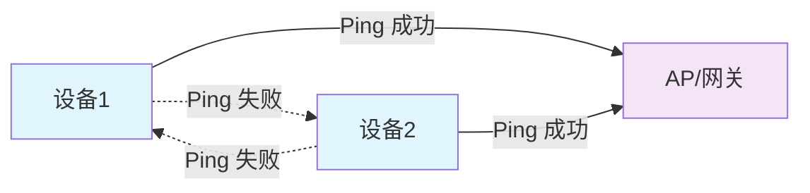

## 1 问题描述
- RK3588
- Android 13
- nm372 wifi模组 cyw43430
- 设备开启热点，作为ap节点建立局域网后，连接到这个局域网的设备可以ping通网关，但是无法互相ping通，如下



## 2 验证
| 设备 | Android 版本 | WiFi 配置 | 结果 |
|------|-------------|-----------|------|
| rk3568 | Android11 | nm372 | pass |
| rk3588 | Android13 | AP系列wifi | fail |
| iqoo neo5 | Android14 |  | pass |
| 未知手机 | Android15 |  | pass |

## 3 解决方式
```diff
diff --git a/kernel-5.10/drivers/net/wireless/rockchip_wlan/dhd-cyw43430/dhd_common.c b/kernel-5.10/drivers/net/wireless/rockchip_wlan/dhd-cyw43430/dhd_common.c
index 0f9195305b..78f6693c36 100644
--- a/kernel-5.10/drivers/net/wireless/rockchip_wlan/dhd-cyw43430/dhd_common.c
+++ b/kernel-5.10/drivers/net/wireless/rockchip_wlan/dhd-cyw43430/dhd_common.c
@@ -1230,15 +1230,16 @@ dhd_wl_ioctl(dhd_pub_t *dhd_pub, int ifidx, wl_ioctl_t *ioc, void *buf, int len)
 						lval = 0;
 					}
 				}
+				printk("witheart");
 				DHD_IOVAR_MEM((
 					"%s: cmd: %d, msg: %s val: 0x%x,"
-					" len: %d, set: %d, txn-id: %d\n",
+					" len: %d, set: %d, txn-idwitheart-3: %d\n",
 					ioc->cmd == WLC_GET_VAR ?
 					"WLC_GET_VAR" : "WLC_SET_VAR",
 					ioc->cmd, msg, lval, ioc->len, ioc->set,
 					dhd_prot_get_ioctl_trans_id(dhd_pub)));
 			} else {
-				DHD_IOVAR_MEM(("%s: cmd: %d, len: %d, set: %d, txn-id: %d\n",
+				DHD_IOVAR_MEM(("%s: cmd: %d, len: %d, set: %d, txn-idwitheart-4: %d\n",
 					ioc->cmd == WLC_GET_VAR ? "WLC_GET_VAR" : "WLC_SET_VAR",
 					ioc->cmd, ioc->len, ioc->set,
 					dhd_prot_get_ioctl_trans_id(dhd_pub)));
diff --git a/kernel-5.10/drivers/net/wireless/rockchip_wlan/dhd-cyw43430/dhd_linux.c b/kernel-5.10/drivers/net/wireless/rockchip_wlan/dhd-cyw43430/dhd_linux.c
index 0833b18511..797a812385 100644
--- a/kernel-5.10/drivers/net/wireless/rockchip_wlan/dhd-cyw43430/dhd_linux.c
+++ b/kernel-5.10/drivers/net/wireless/rockchip_wlan/dhd-cyw43430/dhd_linux.c
@@ -11890,7 +11890,8 @@ dhd_preinit_ioctls(dhd_pub_t *dhd)
 #ifndef PCIE_FULL_DONGLE
 	/* For FD we need all the packets at DHD to handle intra-BSS forwarding */
 	if (FW_SUPPORTED(dhd, ap)) {
-		wl_ap_isolate = AP_ISOLATE_SENDUP_ALL;
+		printk("witheart dhd_linux.c");
+		wl_ap_isolate = AP_ISOLATE_DISABLED;
 		ret = dhd_iovar(dhd, 0, "ap_isolate", (char *)&wl_ap_isolate, sizeof(wl_ap_isolate),
 				NULL, 0, TRUE);
 		if (ret < 0)
diff --git a/kernel-5.10/drivers/net/wireless/rockchip_wlan/dhd-cyw43430/wl_cfg80211.c b/kernel-5.10/drivers/net/wireless/rockchip_wlan/dhd-cyw43430/wl_cfg80211.c
index ed9fc86f33..e6b7b3bec2 100644
--- a/kernel-5.10/drivers/net/wireless/rockchip_wlan/dhd-cyw43430/wl_cfg80211.c
+++ b/kernel-5.10/drivers/net/wireless/rockchip_wlan/dhd-cyw43430/wl_cfg80211.c
@@ -12052,7 +12052,8 @@ wl_cfg80211_change_bss(struct wiphy *wiphy,
 		/* Onus of intra-BSS packet forwarding moved to DHD.
 		 * DHD will handle packet intra-bss packet forwarding.
 		 */
-		err = wldev_iovar_setint(dev, "ap_isolate", AP_ISOLATE_SENDUP_ALL);
+		printk("witheart wl_cfg80211");
+		err = wldev_iovar_setint(dev, "ap_isolate", AP_ISOLATE_DISABLED);
 		if (unlikely(err))
 		{
 			WL_ERR(("set ap_isolate Error (%d)\n", err));

```

## 4 说明
本修改方式应该是调整WiFi驱动，让它不再把数据包发往上层，而是直接在驱动内部进行转发。但目前还没找到上层代码是在哪里通过ap_isolate参数实现访问隔离的。

## 5 解决过程

- 在 AP 本地运行命令 `tcpdump -i wlan0`，可以捕获到 ping 数据包；
- 说明 ping 不通的问题**不是因为包没有进入 AP**，而是 **AP 没有转发 ping 包**；

### 5.1 **logcat 和内核日志搜索 `isolate` 关键字**

```
10-15 17:35:50.667  2451  2451 W WLC_SET_VAR: cmd: 263, msg: ap_isolate val: 0x1, len: 15, set: 1, txn-id: 65535
```

- 日志显示 `ap_isolate` 被设置为 `1`；
- 推测这代表启用了 AP 隔离（AP Isolation）功能；

---

### 5.2 **宏定义位置**

文件路径：  
`kernel-5.10/drivers/net/wireless/rockchip_wlan/dhd-cyw43430/include/wlioctl_defs.h`

```c
/* ap_isolate bitmaps */
#define AP_ISOLATE_DISABLED        0x0
#define AP_ISOLATE_SENDUP_ALL      0x01
#define AP_ISOLATE_SENDUP_MCAST    0x02
```

- 宏定义中 `AP_ISOLATE_DISABLED` 为禁用隔离；
- `AP_ISOLATE_SENDUP_ALL` 为某种隔离模式；

### 5.3 **驱动中配置情况**

- 驱动中的多个位置将 `ap_isolate` 设置为了 `AP_ISOLATE_SENDUP_ALL`；
- 将这些位置修改为 `AP_ISOLATE_DISABLED` 后，**问题解决**。

---

### 5.4 **查找日志来源**

- 试图通过 `WLC_SET_VAR` 搜索日志来源函数，但未能定位；
- 搜索 `cmd` / `msg`，但匹配内容太多，仍不明确；
- 最终通过搜索关键字 `txn-id`，成功定位到日志打印函数：

- 日志打印位置文件路径：  
`kernel-5.10/drivers/net/wireless/rockchip_wlan/dhd-cyw43430/dhd_common.c`

```c
DHD_IOVAR_MEM((
    "%s: cmd: %d, msg: %s val: 0x%x,"
    " len: %d, set: %d, txn-id: %d\n",
    ioc->cmd == WLC_GET_VAR ?
    "WLC_GET_VAR" : "WLC_SET_VAR",
    ioc->cmd, msg, lval, ioc->len, ioc->set,
    dhd_prot_get_ioctl_trans_id(dhd_pub)));
```

---

### 调用链分析
源码中使用dhd_iovar设置AP_ISOLATE_SENDUP_ALL

文件路径：  
`kernel-5.10/drivers/net/wireless/rockchip_wlan/dhd-cyw43430/dhd_linux.c`

```c
int dhd_iovar(dhd_pub_t *pub, int ifidx, char *name, char *param_buf, uint param_len,
              char *res_buf, uint res_len, int set)
```


- `dhd_iovar` 调用了：`dhd_wl_ioctl`

文件路径：  
`kernel-5.10/drivers/net/wireless/rockchip_wlan/dhd-cyw43430/dhd_common.c`

```c
int dhd_wl_ioctl(dhd_pub_t *dhd_pub, int ifidx, wl_ioctl_t *ioc, void *buf, int len)
```

- `DHD_IOVAR_MEM` 的日志打印代码就在 `dhd_wl_ioctl` 中；
