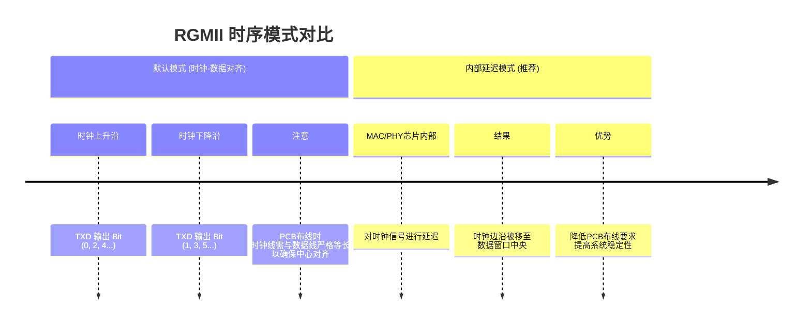

RK3588 的媒体访问控制器（MAC）集成在 CPU 内部，需外接物理层芯片（PHY）协同工作。

MAC 与 PHY 之间通过 RGMII 协议实现数据通信，同时采用 MDIO 接口进行管理和控制信号的交互。

## 1 RGMII

### 1.1 什么是 RGMII？

**RGMII** 的全称是 **Reduced Gigabit Media Independent Interface**，即**精简版千兆介质无关接口**。

它是一种用于连接**MAC（媒体访问控制）** 芯片和**PHY（物理层）** 芯片的并行接口标准。简单来说，在以太网设备（如路由器、交换机、网络摄像机等）中，MAC 芯片负责数据帧的组装和逻辑控制，而 PHY 芯片负责将数字信号转换成可以在网线上传输的模拟信号。RGMII 就是连接这两位“同事”的“高速公路”，确保数据能高效、准确地在它们之间传输。

RGMII 是 GMII 和 TBI 接口的优化和精简版本，旨在减少引脚数量，同时保持千兆（1Gbps）的传输速率。

---

### 1.2 RGMII 的核心特点

1.  **引脚数量少（主要优势）**

    - **GMII**：需要 24 个数据和控制引脚（TX/RX 各 8 位数据+时钟+控制）。
    - **RGMII**：仅需 12 个引脚（TX/RX 各 4 位数据+时钟+控制）。引脚数量减少了一半，极大地节省了 PCB 布局空间和芯片封装成本。

2.  **数据传输速率**

    - 支持 **10Mbps**、**100Mbps** 和 **1000Mbps（1Gbps）** 三种速率，兼容性强。

3.  **双沿采样（DDR）**

    - 为了实现用更少的引脚达到相同的带宽，RGMII 采用了**双倍数据速率** 技术。
    - 在千兆模式下，时钟频率为 **125MHz**。数据在时钟的**上升沿**和**下降沿**都会被采样。
    - 因此，每个时钟周期可以传输 2 个半字节（4bit），4 个数据线 x 125MHz x 2（DDR） = 1000Mbps。

4.  **时钟与数据的时序关系**
    - 这是 RGMII 最关键也最需要注意的一点。为了确保数据能被正确采样，RGMII 规范定义了两种模式：
      - **时钟-数据对齐（默认模式）**：发送端（MAC）在**时钟上升沿**发送数据的**低 4 位**，在**下降沿**发送数据的**高 4 位**。接收端（PHY）以同样的方式接收。这意味着时钟信号的中心应对齐到数据信号的有效窗口中心。
      - **时钟-数据偏移（常见延迟模式）**：在实际的 PCB 布线中，时钟信号和数据信号的传输延迟可能不同步。为了解决这个问题，许多 MAC 和 PHY 芯片支持**内部延迟**模式。在该模式下，PCB 板上的时钟线会被故意绕长或通过芯片内部延迟，使得时钟边沿对准数据的稳定中心。现在，**使用内部延迟已成为最主流和推荐的做法**，可以简化 PCB 设计。

---

### 1.3 RGMII 接口信号定义

一个标准的 RGMII 接口包含以下信号（以 MAC 侧视角为例）：

**发送方向（MAC -> PHY）：**

- `TXC`：发送时钟信号（10/100Mbps 时为 2.5/25MHz，1000Mbps 时为 125MHz）。
- `TXD[3:0]`：4 位发送数据线。
- `TX_CTL`：发送控制信号。在千兆模式下，此信号是一个复合信号：
  - 在时钟上升沿，它表示 `TXD[3:0]` 上的数据是**数据有效指示**。
  - 在时钟下降沿，它表示 `TXD[3:0]` 上的数据是**错误指示**。
  - _简单理解：在正常传输数据时，`TX_CTL` 会一直保持高电平。_

**接收方向（PHY -> MAC）：**

- `RXC`：接收时钟信号（频率同 TXC）。
- `RXD[3:0]`：4 位接收数据线。
- `RX_CTL`：接收控制信号。同样是一个复合信号：
  - 在时钟上升沿，它表示 `RXD[3:0]` 上的数据是**数据有效指示**。
  - 在时钟下降沿，它表示 `RXD[3:0]` 上的数据是**错误指示**。

**管理接口（可选但通常存在）：**

- `MDIO`：管理数据输入输出，用于配置 PHY 芯片的寄存器（如设置速度、双工模式、自协商等）。
- `MDC`：管理数据时钟，为 MDIO 提供时钟。

---

### 1.4 RGMII 的时序与延迟问题

正如前面提到的，时序是 RGMII 设计的核心挑战。下图清晰地展示了 RGMII 的默认时序关系和常见的延迟解决方案：

因此，在硬件设计时，必须查阅 MAC 和 PHY 芯片的数据手册，确认它们支持的延迟模式，并据此决定 PCB 布线的策略。

---

### 1.5 与其他接口的对比

| 特性         | GMII            | RGMII                  |
| :----------- | :-------------- | :--------------------- |
| **引脚数量** | 多（~24）       | **少（~12）**          |
| **技术**     | 单沿采样（SDR） | 双沿采样（DDR）        |
| **速率**     | 10/100/1000Mbps | 10/100/1000Mbps        |
| **特点**     | 引脚多，已过时  | **成本与性能的平衡点** |

## 2 MDIO

### 2.1 什么是 MDIO？

**MDIO** 的全称是 **Management Data Input/Output**，即**管理数据输入/输出**接口。它最初由 IEEE 802.3 标准定义，是 **MII** 系列接口的一个组成部分。

可以把它理解为以太网设备中 **MAC**（处理器）和 **PHY**（物理层芯片）之间的“**管理通道**”或“**配置总线**”。

- **主要目的**：让 MAC（或其它控制器）能够配置和监控 PHY 芯片的工作状态。
- **功能类比**：它非常类似于 I²C 总线。MAC 作为“主人”，通过一个简单的两线制串行总线，去读取和写入各个 PHY 芯片（“仆人”）内部的寄存器，从而实现对网络端口的精细控制和管理。
- MDIO 需要上拉处理
  

---

### 2.2 MDIO 的核心作用

通过 MDIO 接口，MAC 可以对 PHY 进行以下关键操作：

1.  **配置 PHY**：

    - 设置工作模式：**10/100/1000Mbps** 速率，**全双工/半双工**。
    - 启用或禁用**自协商** 功能。
    - 控制**节能**模式（如断电）。
    - 设置 **LED** 指示灯的显示模式。

2.  **监控 PHY 状态**：
    - 读取**链接状态**（是否已连接网线）。
    - 检查自协商是否完成，以及协商结果是什么。
    - 获取错误统计信息（如 CRC 错误、帧丢失等）。
    - 诊断信息（如信号质量、电缆故障等）。

**简单来说，没有 MDIO，MAC 就无法知道网络线是否插上，也无法设置网络速度，PHY 只能以默认的、可能不正确的模式工作。MDIO 是以太网端口能够被智能管理的基础。**

---

### 2.3 MDIO 接口的信号定义

MDIO 接口是一个非常简洁的**两线制**同步串行总线：

| 信号线   | 方向       | 描述                                                                                                                             |
| :------- | :--------- | :------------------------------------------------------------------------------------------------------------------------------- |
| **MDC**  | MAC -> PHY | **管理数据时钟**。由 MAC（主设备）产生的时钟信号，最高频率可达 2.5 MHz（MDIO 1.0）或更高（MDIO 2.0）。数据在时钟的上升沿被采样。 |
| **MDIO** | 双向       | **管理数据输入/输出**。这是一条双向的数据线，用于在 MAC 和 PHY 之间传输地址和数据。                                              |

**关键点**：

- **MDIO 是双向的**，这意味着在某些时刻由 MAC 驱动（写操作时），在另一些时刻由 PHY 驱动（读操作时）。这需要主机控制器有相应的驱动控制逻辑。
- 总线支持连接**多个 PHY** 设备，通过唯一的 **PHY 地址** 来区分它们。

---

### 2.4 MDIO 的发展：Clause 22 与 Clause 45

MDIO 协议有两个主要版本，了解它们的区别非常重要。

| 特性             | **Clause 22**                  | **Clause 45**                                                 |
| :--------------- | :----------------------------- | :------------------------------------------------------------ |
| **来源**         | IEEE 802.3 标准**第 22 节**    | IEEE 802.3 标准**第 45 节**                                   |
| **别名**         | 经典 MDIO                      | 增强型 MDIO                                                   |
| **寻址能力**     | 5 位 PHY 地址 + 5 位寄存器地址 | 5 位 PHY 地址 + **16 位寄存器地址**                           |
| **最大 PHY 数**  | 32                             | 32                                                            |
| **最大寄存器数** | 32                             | 65536                                                         |
| **操作码**       | `01`：写，`10`：读             | 更丰富，如 `00`：地址，`01`：写，`11`：读，`10`：后读增量地址 |
| **应用场景**     | 早期和基础的 10/100M PHY       | 千兆、万兆及更高速的 PHY，功能更复杂                          |

**为什么需要 Clause 45？**
随着网络速度提升到千兆、万兆，PHY 芯片需要监控和配置的参数急剧增加，32 个寄存器远远不够。Clause 45 通过引入两级寻址（先指定设备地址和寄存器地址，再进行读写），极大地扩展了地址空间，满足了现代高速 PHY 的需求。

**兼容性**：Clause 45 帧格式的设计使其能与 Clause 22 在物理层上兼容。主机可以通过发送 Clause 45 特有的“地址”操作码来探测 PHY 是否支持 Clause 45。

## 3 PHY 芯片晶振

- 千兆 PHY 需要的时钟信号一般为 25MHz
- 可以外挂晶振，或者由 CPU 产生时钟信号
  

## 4 网络变压器

- PHY 芯片将数字信号转换为差分信号，差分信号需要连接网络变压器才能连接到 RJ-45 接口
  

- 网络变压器
  

### 4.1 核心定义

**网络变压器**是安装在以太网设备（如路由器、电脑网卡）的 **RJ-45 接口**和 **PHY 芯片** 之间的一个模块。它的主要功能包括**电气隔离、信号传输、阻抗匹配**和**信号整形**。

尽管它叫“变压器”，但在网络连接中扮演着不可或缺的角色。

---

### 4.2 **电气隔离 - 最核心的功能**

这是网络变压器最重要的作用。

- **隔离直流分量**：PHY 芯片发出的信号是包含直流分量和交流信号的电信号。变压器利用电磁感应原理，只允许交流信号（即数据信号）通过，而阻断直流分量，实现了前后端电路的直流隔离。
- **防止地环流**：当两个互连的设备分别接入不同电网或接地不良时，它们之间可能存在“地电位差”。如果没有变压器隔离，这个电位差会产生巨大的地环流，直接烧毁 PHY 芯片。变压器切断了直接的电气连接，保护了设备。
- **抗共模干扰**：外界电磁干扰（如雷击、电网浪涌、电机启停）通常会同时作用于网线中的两根信号线（共模干扰）。变压器能有效抑制这类干扰，确保信号质量。

### 4.3 **信号传输**

在隔离的同时，变压器通过磁耦合将数据信号从初级线圈传递到次级线圈，高效地完成了信号的传输任务。

### 4.4 **阻抗匹配**

网线的特性阻抗通常是 100 欧姆。网络变压器可以帮助实现 PHY 芯片驱动电路与网线特性阻抗之间的匹配，减少信号在传输过程中的反射，从而保证信号质量，延长传输距离。

## 5 网络唤醒
- 网络唤醒，简称 WoL，是一种计算机网络标准，允许一台处于休眠或关机状态（但电源未完全切断）的计算机，通过网络接收到特定的信号包后被远程唤醒或启动。
- PHY可能会有网络唤醒引脚，当接受到唤醒魔包时，便动作该引脚。可以用于唤醒cpu。
- 魔包是实现网络唤醒的“魔法咒语”，是一种特殊格式的网络数据帧。当 魔包（正确的指令）通过网络到达目标设备的网卡时，被启用了WoL功能的网卡识别，随后网卡通过 网络唤醒引脚（WAKE#）这个硬件通道向主板发送电信号，最终由主板完成整个系统的上电唤醒流程。
