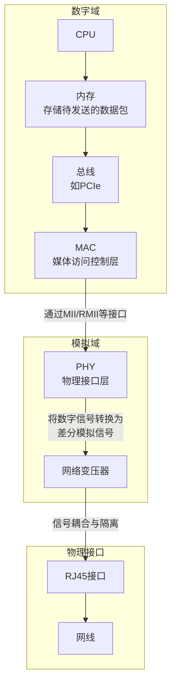

## 1 什么是有线网口？

**有线网口**，通常被称为**以太网端口**、**网络接口** 或 **RJ-45 端口**，是电子设备（如计算机、路由器、交换机、智能电视等）上用于通过网线（双绞线）连接到有线网络的物理接口。

它的核心功能是作为一个**物理桥梁**，将设备与局域网（LAN）或互联网进行稳定、高速的数据连接。

---

## 2 核心特点与外观识别

- **物理外观**：是一个矩形插槽，比常见的电话线接口（RJ-11）略宽。
- **内部结构**：有 8 个金属触点，对应网线中 8 根铜线的位置。
- **指示灯**：通常旁边会有两个 LED 指示灯：用于指示链路物理上是否建立，链路有无活动

---

## 3 技术标准与协议：速度的演进

有线网口遵循**IEEE 802.3**系列标准，其速度经历了多代发展。最常见的标准如下表所示：

| 标准名称         | 通用叫法                              | 最大速度           | 常见应用场景                                     |
| :--------------- | :------------------------------------ | :----------------- | :----------------------------------------------- |
| **IEEE 802.3i**  | **10BASE-T**                          | 10 Mbps            | 已被淘汰，见于非常古老的设备                     |
| **IEEE 802.3u**  | **Fast Ethernet（百兆以太网）**       | 100 Mbps           | 早期家庭路由器、老旧电脑、基础物联网设备         |
| **IEEE 802.3ab** | **Gigabit Ethernet（千兆以太网）**    | 1000 Mbps (1 Gbps) | **当前主流**，绝大多数家用/商用电脑、路由器、NAS |
| **IEEE 802.3bz** | **2.5G/5G BASE-T**                    | 2.5 Gbps / 5 Gbps  | 高端主板、进阶 NAS、满足高速内网传输             |
| **IEEE 802.3an** | **10 Gigabit Ethernet（万兆以太网）** | 10 Gbps            | 数据中心、高性能工作站、企业级服务器             |

**关键点**：

- **自适应**：现代网口都支持**自动协商**，可以自动与连接的另一端设备（如路由器）协商出双方都支持的最高速度。
- **向下兼容**：一个千兆网口可以正常连接百兆设备，但速度会降至百兆。

## 4 层次分析

简单来说，数据从 CPU 到网口的路径可以概括为：
**CPU → （内存） → 集成在 CPU 的控制器或 PCH 上的 MAC → （内部总线） → 独立的或 PCH 集成的 PHY → （模拟信号） → 网络变压器 → RJ45 接口 → 网线**

为了更直观地理解这一数据流，我们可以参考下面的流程图，它清晰地展示了数据从 CPU 到网线的完整路径：

---

### 4.1 层次 1： 主处理器（CPU）和内存

- **角色**：数据的“大脑”和“临时仓库”。
- **过程**：当操作系统上的应用程序需要发送网络数据时，CPU 会准备数据，并将待发送的数据包（Packet）存放在系统内存的特定缓冲区中。CPU 本身并不处理数据包的底层细节，它只负责下达指令。

### 4.2 层次 2： 总线接口 - PCIe

- **角色**：连接 CPU/Memory 与网络控制器的“高速公路”。
- **过程**：对于独立的网卡（NIC），或者即使 MAC 集成在 PCH（平台控制器枢纽，以前叫南桥）中，它们与 CPU 和内存之间的数据交换也是通过高速串行总线完成的，目前最主要的就是**PCI Express**总线。数据通过 DMA（直接内存访问）技术，不经过 CPU，直接在内存和网络控制器之间传输，极大提高了效率。

### 4.3 层次 3： MAC（Media Access Control）层

- **角色**：数据链路层的“下半部分”，负责数据帧的“封装和调度”。
- **功能**：
  - **帧构建**：将来自上层的数据包添加帧头（源/目标 MAC 地址）、帧尾（CRC 校验码），组装成符合 IEEE 802.3 标准的以太网帧。
  - **MAC 地址**：每个网口的唯一物理地址就是 MAC 地址。
  - **流量控制**：处理网络拥塞，例如发送暂停帧。
  - **CRC 校验**：计算并添加校验码，保证数据完整性。
- **实现方式**：
  - **集成在 CPU 或 PCH 中**：现代主板上的板载网卡，其 MAC 控制器通常集成在 PCH 芯片内。
  - **集成在独立网卡芯片中**：独立的 PCIe 网卡上，MAC 控制器是网卡主芯片的核心。

### 4.4 层次 4： MAC 与 PHY 之间的接口 - MII/RMII/RGMII 等

- **角色**：连接数字逻辑（MAC）和模拟电路（PHY）的“桥梁协议”。
- **功能**：这是一组标准的并行接口，用于传输数据和控制信号。常见的类型有：
  - **MII**：原始标准，数据位宽 4bit，需要较多引脚。
  - **RMII**：精简 MII，数据位宽 2bit，引脚数减少一半。
  - **RGMII**：目前最主流的标准，数据位宽 8bit，可在时钟上下沿传输数据，效率高，用于千兆（1Gbps）网络。
- **重要性**：这个接口是标准化的，使得不同厂商的 MAC 可以和不同厂商的 PHY 芯片配对使用。

### 4.5 层次 5： PHY（Physical Layer）芯片

- **角色**：数字世界与模拟世界的“翻译官”和“调制解调器”。
- **功能**：
  - **数模转换**：将来自 MAC 的**数字信号**转换成在网线上传输的**模拟差分信号**。
  - **线路编码**：使用如**MLT-3**（百兆）或**PAM-5/PAM-3**（千兆/万兆）等编码技术，以适应双绞线的传输特性。
  - **信号驱动**：增强信号强度，以便信号能在最长 100 米的网线上可靠传输。
  - **自动协商**：与链路另一端的设备（如交换机）协商速度（10/100/1000M）、双工模式（全双工/半双工）。
  - **链路检测**：检测链路的通断。

### 4.6 层次 6： 网络变压器（Magnetics Module 或 LAN Transformer）

- **角色**：信号的“保护神”和“隔离器”。
- **功能**：
  - **电气隔离**：隔离 PHY 芯片和网线，防止网线因雷击、静电等引入的高压浪涌损坏主板上的精密芯片。
  - **信号耦合**：让有用的差分信号高效通过，同时阻隔直流分量。
  - **阻抗匹配**：确保信号在传输过程中反射最小，信号完整性最佳。
  - **共模抑制**：抑制网线受到的共模干扰（如来自电源线的干扰）。
- **外观**：通常是一个黑色的方块，紧靠在 RJ45 接口后面。有时它会和 RJ45 接口集成在一起，成为“带变压器的 RJ45 插座”。

### 4.7 层次 7： RJ45 接口

- **角色**：整个链路的“物理终点”和“连接器”。
- **功能**：提供网线的物理插拔接口，内部有 8 个金属触点，对应网线中的 4 对双绞线。

### 4.8 总结
1.  **软件层面**：CPU 处理高层协议（TCP/IP）和数据。
2.  **数字逻辑层面**：MAC 控制器负责帧的封装和协议控制。
3.  **数模转换层面**：PHY 芯片将数字比特流转换为模拟电信号。
4.  **物理保护层面**：网络变压器提供电气隔离和信号调理。
5.  **物理连接层面**：RJ45 接口完成最终的物理连接。
