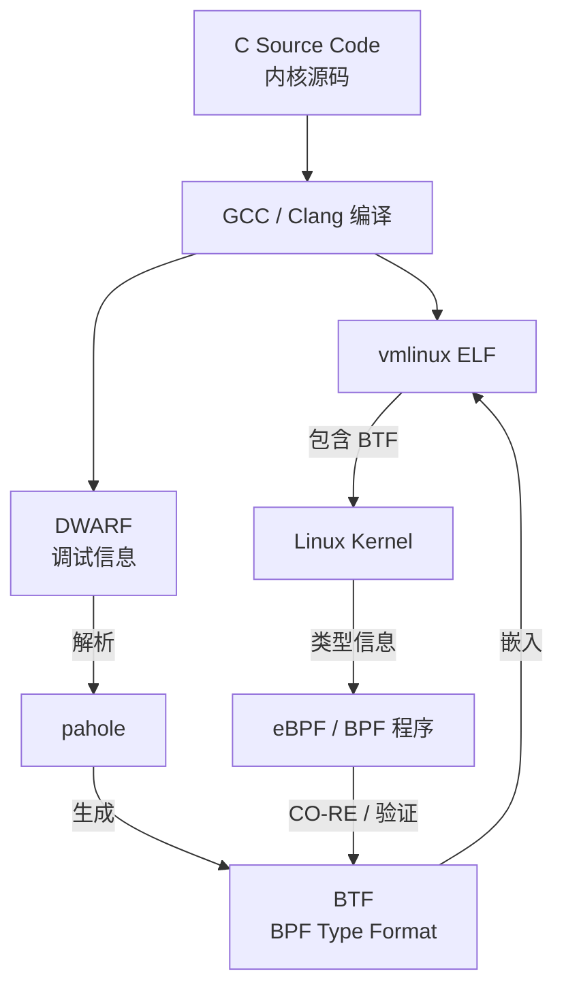

## 问题描述
首次编译RK3588 Android15镜像时，报错
```bash
BTF: .tmp_vmlinux.btf: pahole (pahole) is not available
Failed to generate BTF for vmlinux
Try to disable CONFIG_DEBUG_INFO_BTF
make[2]: *** [scripts/Makefile.vmlinux:34: vmlinux] Error 1
make[1]: *** [Makefile:1314: vmlinux] Error 2
make[1]: *** Waiting for unfinished jobs....
```

## 解决方式
```bash
sudo apt update
sudo apt install dwarves  # pahole 包含在 dwarves 包中
```

## 问题解析
编译 Linux 内核时需要生成 BTF（BPF Type Format）信息，但系统缺少 pahole工具，这是一个从 DWARF 调试信息生成 BTF 的工具。BTF 是一种调试信息格式，主要用于增强 eBPF 程序的调试和性能分析功能。


