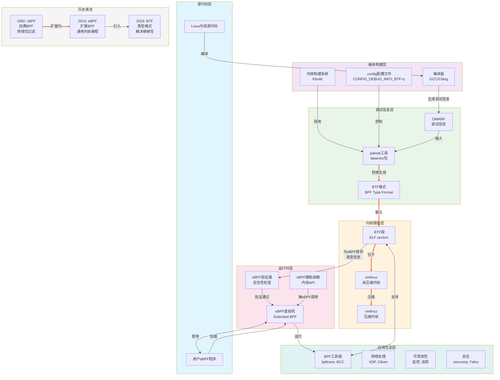

## 关系图



## 详细关系说明表格

| 关系路径                 | 说明                     | 技术细节                                                        |
| ------------------------ | ------------------------ | --------------------------------------------------------------- |
| **编译器 → DWARF**       | 编译器生成详细的调试信息 | GCC/Clang 使用`-g`选项生成 DWARF 格式，包含完整符号表和类型信息 |
| **DWARF → pahole → BTF** | 调试信息转换流程         | pahole 从 DWARF 提取类型，去重、优化后生成紧凑的 BTF 二进制格式 |
| **.config 控制**         | 编译选项决定是否生成 BTF | `CONFIG_DEBUG_INFO_BTF=y`启用，`=n`禁用 BTF 生成                |
| **vmlinux 包含.BTF 段**  | BTF 作为 ELF 段嵌入内核  | ELF 文件中专门的`.BTF`段存储类型信息，`readelf -S`可查看        |
| **BTF → eBPF 验证器**    | 类型信息用于安全验证     | eBPF 程序加载时，验证器使用 BTF 检查内存访问安全性和类型正确性  |
| **eBPF → 应用生态**      | 运行时支持各种应用场景   | 包括网络处理、系统监控、安全策略、性能分析等                    |

## 数据流详细说明

### 1. **编译阶段数据流**

```
内核源码 + 配置文件
     ↓ (make命令)
编译过程开始
     ↓ (GCC/Clang)
生成对象文件(.o) + DWARF调试信息
     ↓ (链接器ld)
生成vmlinux(含DWARF)
     ↓ (如果CONFIG_DEBUG_INFO_BTF=y)
调用pahole工具
     ↓
读取DWARF，生成BTF
     ↓
将.BTF段写入vmlinux
     ↓
最终内核镜像
```

### 2. **运行时 eBPF 数据流**

```
用户空间eBPF程序
     ↓ (bpf()系统调用)
加载到内核
     ↓
eBPF验证器检查
     ├── 使用BTF验证类型安全
     ├── 检查内存访问边界
     └── 验证辅助函数调用
     ↓ (通过验证)
JIT编译为机器码
     ↓
在内核中执行
     ↓
通过maps与用户空间通信
```

### 3. **工具依赖关系**

```
        +----------------+
        |   dwarves包    |
        | (提供pahole)   |
        +-------+--------+
                |
                v
        +-------+--------+
        |    pahole      |
        | (DWARF→BTF转换)|
        +-------+--------+
                |
                v
+---------------+---------------+
|       BTF支持的工具链         |
+-------------------------------+
| bpftrace | BCC | Cilium | ...|
+----------+-----+--------+----+
```

## 关键转换过程对比

### DWARF vs BTF 对比

| 特性     | DWARF         | BTF           |
| -------- | ------------- | ------------- |
| **格式** | 复杂，多段式  | 紧凑，单段式  |
| **大小** | 较大(数百 MB) | 较小(几 MB)   |
| **内容** | 完整调试信息  | 仅类型信息    |
| **用途** | 源码级调试    | eBPF 类型检查 |
| **加载** | 需要调试器    | 内核直接使用  |

## 演进时间线

```
时间轴: 1992 ────→ 2014 ────→ 2019 ────→ 现在
       cBPF       eBPF       BTF       完整生态

里程碑:
• 1992: cBPF诞生，用于tcpdump包过滤
• 2014: Linux 3.15引入eBPF，扩展到通用计算
• 2015: Linux 4.1引入kprobes支持
• 2017: Linux 4.11引入XDP(高速网络)
• 2019: Linux 5.2引入BTF和BPF CO-RE
• 2020: Linux 5.7引入BPF迭代器
• 至今: 完整eBPF生态，包括Cilium、Falco等
```
