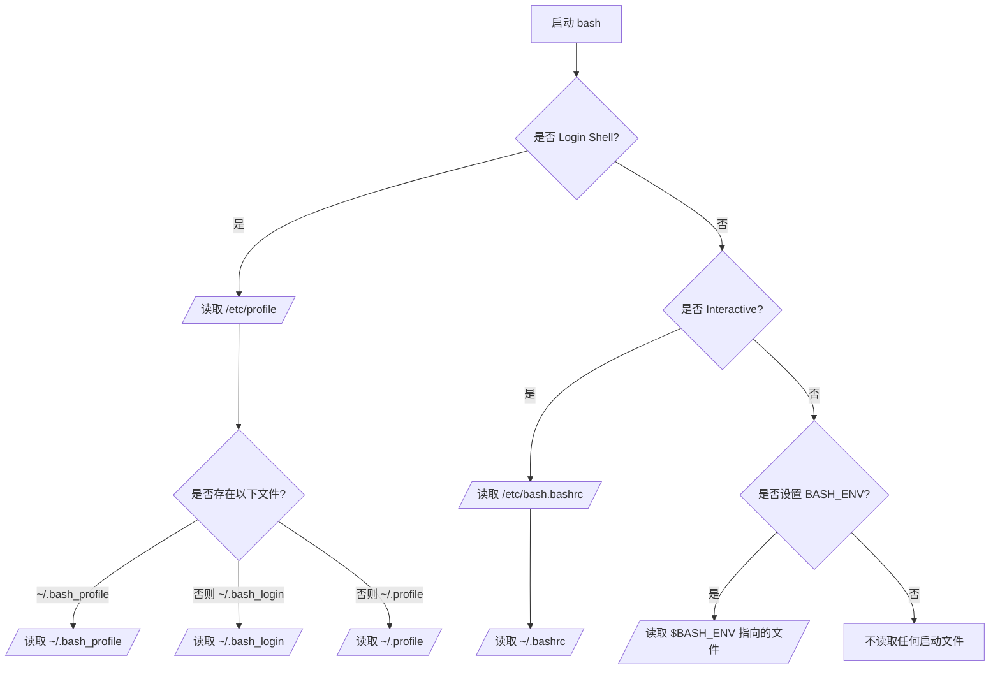

## 原始文档
- man bash

INVOCATION
A login shell is one whose first character of argument zero is a -, or one started with the --login option.

An interactive shell is one started without non-option arguments (unless -s is specified) and without the -c option whose standard input and error are both connected to terminals (as determined by isatty(3)), or one started with the -i option. PS1 is set and $- includes i if bash is interactive, allowing a shell script or a startup file to test this state.

The following paragraphs describe how bash executes its startup files. If any of the files exist but cannot be read, bash reports an error. Tildes are expanded in filenames as described below under Tilde Expansion in the EXPANSION section.

When bash is invoked as an interactive login shell, or as a non-interactive shell with the --login option, it first reads and executes commands from the file /etc/profile, if that file exists. After reading that file, it looks for ~/.bash_profile, ~/.bash_login, and ~/.profile, in that order, and reads and executes commands from the first one that exists and is readable. The --noprofile option may be used when the shell is started to inhibit this behavior.

When an interactive login shell exits, or a non-interactive login shell executes the exit builtin command, bash reads and executes commands from the file ~/.bash_logout, if it exists.

When an interactive shell that is not a login shell is started, bash reads and executes commands from /etc/bash.bashrc and ~/.bashrc, if these files exist. This may be inhibited by using the --norc option. The --rcfile file option will force bash to read and execute commands from file instead of /etc/bash.bashrc and ~/.bashrc.

When bash is started non-interactively, to run a shell script, for example, it looks for the variable BASH_ENV in the environment, expands its value if it appears there, and uses the expanded value as the name of a file to read and execute. Bash behaves as if the following command were executed:
       if [ -n "$BASH_ENV" ]; then . "$BASH_ENV"; fi
but the value of the PATH variable is not used to search for the filename.

If bash is invoked with the name sh, it tries to mimic the startup behavior of historical versions of sh as closely as possible, while conforming to the POSIX standard as well. When invoked as an interactive login shell, or a non-interactive shell with the --login option, it first attempts to read and execute commands from /etc/profile and ~/.profile, in that order. The --noprofile option may be used to inhibit this behavior. When invoked as an interactive shell with the name sh, bash looks for the variable ENV, expands its value if it is defined, and uses the expanded value as the name of a file to read and execute. Since a shell invoked as sh does not attempt to read and execute commands from any other startup files, the --rcfile option has no effect. A non-interactive shell invoked with the name sh does not attempt to read any other startup files. When invoked as sh, bash enters posix mode after the startup files are read.

When bash is started in posix mode, as with the --posix command line option, it follows the POSIX standard for startup files. In this mode, interactive shells expand the ENV variable and commands are read and executed from the file whose name is the expanded value. No other startup files are read.

Bash attempts to determine when it is being run with its standard input connected to a network connection, as when executed by the remote shell daemon, usually rshd, or the secure shell daemon sshd. If bash determines it is being run in this fashion, it reads and executes commands from ~/.bashrc and ~/.bashrc, if these files exist and are readable. It will not do this if invoked as sh. The --norc option may be used to inhibit this behavior, and the --rcfile option may be used to force another file to be read, but neither rshd nor sshd generally invoke the shell with those options or allow them to be specified.

If the shell is started with the effective user (group) id not equal to the real user (group) id, and the -p option is not supplied, no startup files are read, shell functions are not inherited from the environment, the SHELLOPTS, BASHOPTS, CDPATH, and GLOBIGNORE variables, if they appear in the environment, are ignored, and the effective user id is set to the real user id. If the -p option is supplied at invocation, the startup behavior is the same, but the effective user id is not reset.


## 翻译

**调用方式**  
若参数零的第一个字符为 `-`，或启动时指定了 `--login` 选项，则该 shell 称为登录 shell。

若 shell 启动时未指定非选项参数（除非使用了 `-s` 选项）且未使用 `-c` 选项，同时其标准输入和标准错误均连接到终端（由 `isatty(3)` 判断），或启动时使用了 `-i` 选项，则该 shell 称为交互式 shell。如果 bash 处于交互模式，则会设置 `PS1` 变量且 `$-` 包含字符 `i`，以便 shell 脚本或启动文件检测此状态。

以下段落描述 bash 如何执行其启动文件。若任何文件存在但不可读，bash 将报告错误。文件名中的波浪符（`~`）会按 **扩展** 章节中 **波浪符扩展** 部分的说明进行扩展。

当 bash 作为交互式登录 shell 启动，或作为带有 `--login` 选项的非交互式 shell 启动时，它首先读取并执行 `/etc/profile` 文件中的命令（如果该文件存在）。读取该文件后，bash 按顺序查找 `~/.bash_profile`、`~/.bash_login` 和 `~/.profile`，并读取并执行第一个存在且可读的文件。启动 shell 时使用 `--noprofile` 选项可禁用此行为。

当交互式登录 shell 退出，或非交互式登录 shell 执行内置命令 `exit` 时，bash 会读取并执行 `~/.bash_logout` 文件中的命令（如果该文件存在）。

当启动的不是登录 shell 的交互式 shell 时，bash 会读取并执行 `/etc/bash.bashrc` 和 `~/.bashrc` 中的命令（如果这些文件存在）。使用 `--norc` 选项可禁用此行为。`--rcfile file` 选项会强制 bash 从指定文件而非 `/etc/bash.bashrc` 和 `~/.bashrc` 中读取并执行命令。

当 bash 以非交互方式启动（例如运行 shell 脚本）时，它会在环境中查找变量 `BASH_ENV`，若存在则扩展其值，并将扩展后的值作为要读取和执行的文件名。bash 的行为类似于执行以下命令：
```bash
if [ -n "$BASH_ENV" ]; then . "$BASH_ENV"; fi
```
但不会使用 `PATH` 变量的值来搜索该文件名。

如果 bash 以名称 `sh` 调用，它会尽可能模仿历史版本 sh 的启动行为，同时遵循 POSIX 标准。当作为交互式登录 shell 或带有 `--login` 选项的非交互式 shell 调用时，它首先尝试按顺序读取并执行 `/etc/profile` 和 `~/.profile` 中的命令。可使用 `--noprofile` 选项禁用此行为。当以名称 `sh` 作为交互式 shell 调用时，bash 会查找变量 `ENV`，若已定义则扩展其值，并将扩展后的值作为要读取和执行的文件名。由于以 `sh` 调用的 shell 不会尝试读取和执行任何其他启动文件中的命令，因此 `--rcfile` 选项无效。以名称 `sh` 调用的非交互式 shell 不会尝试读取任何其他启动文件。当以 `sh` 调用时，bash 在读取启动文件后会进入 posix 模式。

当 bash 以 posix 模式启动（例如通过 `--posix` 命令行选项）时，它会遵循 POSIX 标准处理启动文件。在此模式下，交互式 shell 会扩展 `ENV` 变量，并从该扩展值指定的文件中读取并执行命令。不会读取其他启动文件。

bash 会尝试判断其标准输入是否连接到网络连接（例如由远程 shell 守护进程 rshd 或安全 shell 守护进程 sshd 执行时）。如果 bash 判定以此方式运行，则会读取并执行 `~/.bashrc` 中的命令（如果该文件存在且可读）。若以 `sh` 调用，则不会执行此操作。`--norc` 选项可用于禁用此行为，`--rcfile` 选项可用于强制读取其他文件，但 rshd 和 sshd 通常不会使用这些选项调用 shell，也不允许指定这些选项。

如果 shell 启动时有效用户（组）ID 不等于真实用户（组）ID，且未提供 `-p` 选项，则不会读取任何启动文件，不会从环境中继承 shell 函数，环境中的 `SHELLOPTS`、`BASHOPTS`、`CDPATH` 和 `GLOBIGNORE` 变量（如果存在）将被忽略，同时有效用户 ID 会被设置为真实用户 ID。若调用时提供了 `-p` 选项，启动行为相同，但有效用户 ID 不会被重置。

## 表格
### 常见情况
| Shell 类型/条件                               | 调用方式/选项                                                        | 启动文件读取顺序（如果存在且可读）                                                           | 特殊行为/备注                                                                               |
| --------------------------------------------- | -------------------------------------------------------------------- | -------------------------------------------------------------------------------------------- | ------------------------------------------------------------------------------------------- |
| **交互式登录 shell**                          | 参数零的第一个字符为 `-` 或使用 `--login` 选项                       | 1. `/etc/profile`<br>2. `~/.bash_profile`、`~/.bash_login`、`~/.profile`（按顺序读取第一个） | 退出时读取并执行 `~/.bash_logout`；可使用 `--noprofile` 禁用启动文件读取                    |
| **非交互式登录 shell**                        | 使用 `--login` 选项的非交互式 shell                                  | 同上（读取登录 shell 的启动文件）                                                            | 执行 `exit` 内置命令时读取 `~/.bash_logout`；可使用 `--noprofile` 禁用                      |
| **交互式非登录 shell**                        | 交互式启动（标准输入和错误连接终端），且非登录（无 `--login`）       | `/etc/bash.bashrc` 和 `~/.bashrc`                                                            | 可使用 `--norc` 禁用；`--rcfile file` 可指定替代文件                                        |
| **非交互式 shell（运行脚本）**                | 非交互式启动（如执行脚本）                                           | 查找环境变量 `BASH_ENV`，执行其值指定的文件                                                  | 不搜索 `PATH` 来定位文件；行为类似于 `if [ -n "$BASH_ENV" ]; then . "$BASH_ENV"; fi`        |



## .profile文件
目前接触的Ubuntu桌面系统中，大多数没有~/.bash_profile，~/.bash_login，但是一般有~/.profile。查看其内容，如下：
```bash
$ cat ~/.profile
# ~/.profile: executed by the command interpreter for login shells.
# This file is not read by bash(1), if ~/.bash_profile or ~/.bash_login
# exists.
# see /usr/share/doc/bash/examples/startup-files for examples.
# the files are located in the bash-doc package.

# the default umask is set in /etc/profile; for setting the umask
# for ssh logins, install and configure the libpam-umask package.
#umask 022

# if running bash
if [ -n "$BASH_VERSION" ]; then
    # include .bashrc if it exists
    if [ -f "$HOME/.bashrc" ]; then
        . "$HOME/.bashrc"
    fi
fi

# set PATH so it includes user's private bin if it exists
if [ -d "$HOME/bin" ] ; then
    PATH="$HOME/bin:$PATH"
fi

# set PATH so it includes user's private bin if it exists
if [ -d "$HOME/.local/bin" ] ; then
    PATH="$HOME/.local/bin:$PATH"
fi

```

发现`.profile`实际上会加载`$HOME/.bashrc`，也就是只有非登录非交互的shell不读`.bashrc`，只要是登录shell，或者不登录但是交互的shell，都会加载`.bashrc`的。
