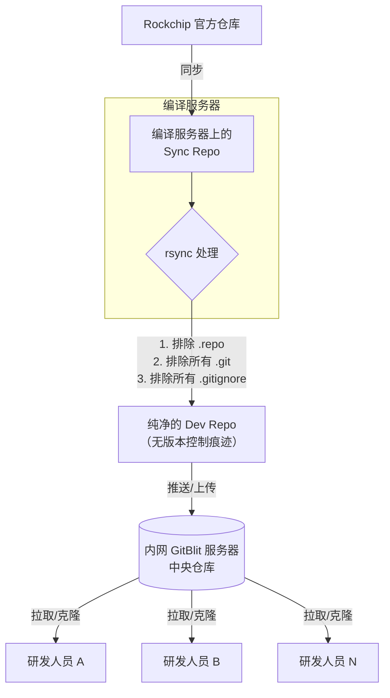

概要：本文介绍了如何在编译服务器上同步 Rockchip SDK 官方仓库（Sync Repo），并将其处理为干净的开发仓库（Dev Repo），最终上传至内网 GitBlit 供研发人员拉取开发。文中包含同步处理的指令说明及完整的流程图示意。


## 1. Rockchip 官方仓库同步流程  

编译服务器维护 Rockchip SDK 的官方仓库（official repo），称为 **Sync Repo**，该仓库用于从 Rockchip 官方进行同步更新。

---

## 2. 创建 Dev Repo 开发仓库  

为了建立研发使用的纯净开发仓库（Dev Repo），需要从 Sync Repo 复制内容时排除与版本控制有关的目录和文件。

### 2.1 具体操作命令  

使用如下命令，通过 `rsync` 工具复制内容并排除不需要的文件：

```bash
rsync -av \
  --exclude='/.repo' \
  --exclude='**/.git' \
  --exclude='**/.gitignore' \
  /mnt/nvme/RK3588_SDK-251108/Rockchip_Android15.0_SDK_Release/RK3588_Android15_sync_repo/ \
  /mnt/nvme/RK3588_SDK-251108/Rockchip_Android15.0_SDK_Release/RK3588_Android15_dev/
```

### 2.2 参数说明  

- `-a`：归档模式，保持文件属性（权限、时间戳等），并递归复制  
- `-v`：显示详细输出  
- `--delete`（可选）：若希望完全同步目录，即删除目标目录中源目录不存在的文件，可加入此选项

---

## 3. 推送到内网 GitBlit  

将生成的 Dev Repo 上传至内网 GitBlit 服务器，作为研发人员开发的中央仓库。

---

## 4. 研发人员拉取开发  

内网其他研发人员可从 GitBlit 上 Clone Dev Repo 到本地进行开发，避免官方仓库中的历史记录和编译系统干扰。

---

## 5. 流程图  


