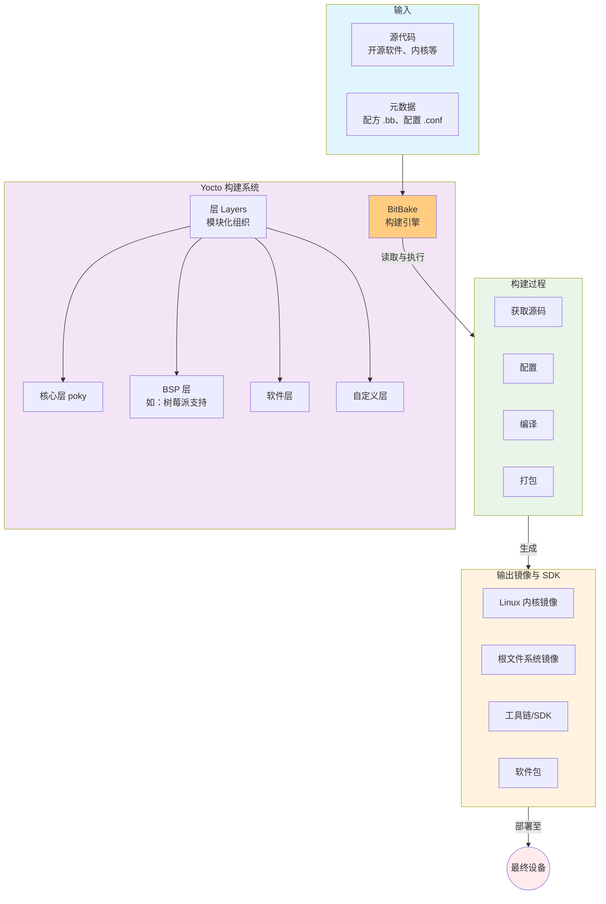

## 一、Yocto是什么？

**一句话定义：Yocto不是一个操作系统，而是一个“构建系统”或“工具集合”，它帮你从头开始打造完全定制化的嵌入式Linux系统。**

想象一下：
- 你想烤一个**专属蛋糕**（嵌入式Linux系统）
- 市面上有**预拌粉**（现成的发行版如Ubuntu，可能包含不需要的东西）
- 而Yocto给了你**完整的厨房、食谱和食材**（工具链、配方、源代码），让你可以从面粉、糖开始，精确控制每一种原料，烤出完全符合你需求的蛋糕


## 二、核心价值：为什么需要Yocto？

在嵌入式开发中，设备千差万别：
- **硬件不同**：树莓派、工控机、物联网设备各有各的处理器架构和外设
- **需求各异**：有的需要极小的系统体积，有的需要实时性，有的需要特定驱动
- **长期维护**：产品生命周期可能长达10-15年，需要稳定的软件供应链

**传统方式**：手动交叉编译、拼凑组件 → **繁琐、易错、难维护**
**Yocto方式**：自动化、可重复、可追溯的构建 → **高效、一致、可控**

## 三、核心概念拆解

## 1. **BitBake** - 构建引擎
Yocto的心脏，相当于“自动化厨师”。它读取“食谱”，根据指令获取原料、执行操作，最终产出成品。

## 2. **元数据（Metadata）** - 构建规则
包括三个核心层：
- **配方（Recipes）**：`.bb`文件，每个文件描述如何构建一个软件包（如：从哪里下载源码、如何配置、如何编译）
- **配置（Configurations）**：`.conf`文件，定义全局设置（如：目标架构、编译器选项）
- **类（Classes）**：`.bbclass`文件，提供可重用的构建逻辑片段

## 3. **层（Layers）** - 模块化组织
Yocto采用分层架构，就像书本的章节：
- **核心层**：`poky`（Yocto的基础层，包含构建系统本身）
- **BSP层**：板级支持包，针对特定硬件的驱动和配置
- **软件层**：额外的软件包集合
- **自定义层**：你自己创建的层，包含产品特定配置

**关键优势**：你可以像搭积木一样组合这些层，复用社区贡献，同时保持自己的定制内容独立。

## 四、工作流程：从源码到镜像

```
源代码 → BitBake读取配方 → 下载源码 → 打补丁 → 配置 → 编译 → 打包 → 生成镜像
```

**产出物包括**：
- **根文件系统镜像**：系统运行的基础文件
- **内核镜像**：定制的Linux内核
- **SDK工具链**：用于开发应用程序的交叉编译环境
- **软件包仓库**：便于后期更新
