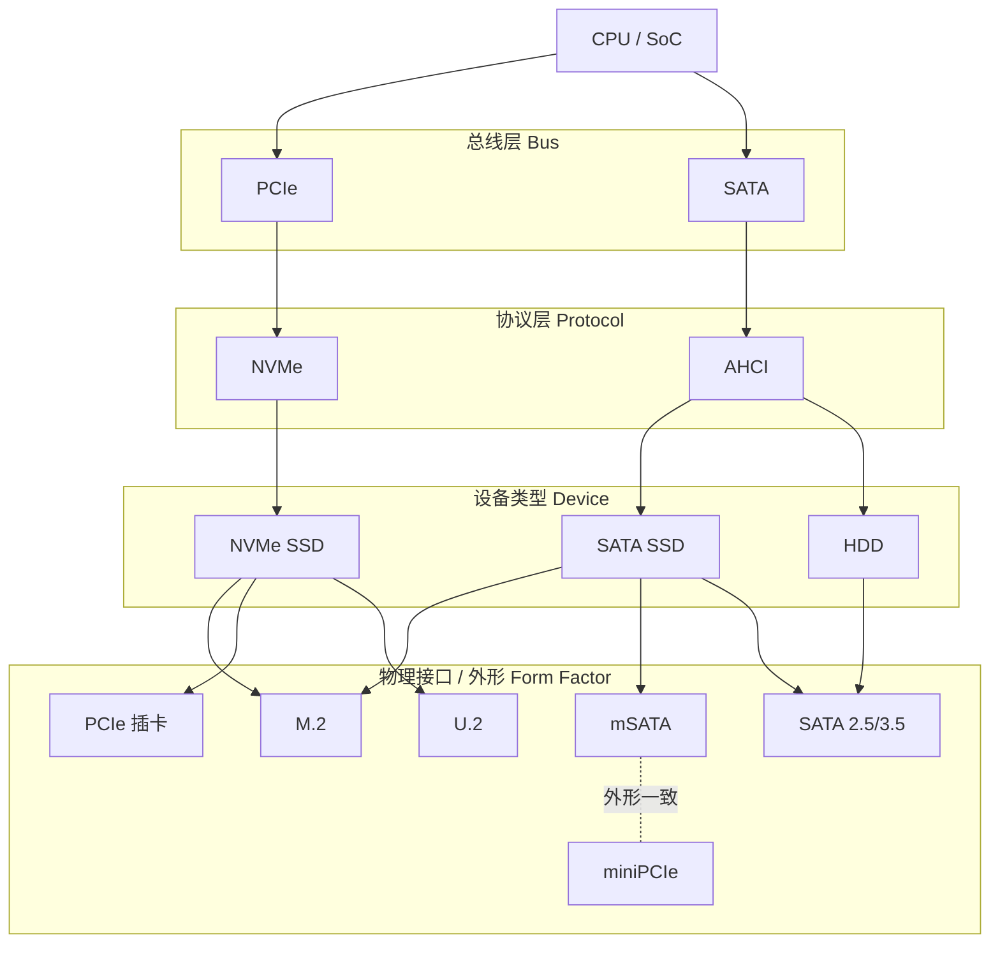

## 一、一句话概括

> **PCIe / SATA 是“高速公路”（总线）
> AHCI / NVMe 是“交通规则”（协议）
> mSATA / miniPCIe 是“插头长什么样”（物理接口形态）**

---

## 二、从底层开始：总线（Bus）

### 1️⃣ PCIe（Peripheral Component Interconnect Express）

**PCIe 是什么？**

- 一种**高速串行总线**
- CPU ↔ 外设之间的数据通道
- 现在几乎所有高性能设备都用它

**特点：**

- 点对点（不像 PCI 共享总线）
- Lane 可扩展：x1 / x4 / x8 / x16
- 双向全双工
- 带宽随代际提升（Gen3/4/5）

**典型设备：**

- NVMe SSD
- GPU
- 网卡
- RAID 卡
- AI 加速卡

---

### 2️⃣ SATA（Serial ATA）

**SATA 是什么？**

- 一种**存储专用总线**
- 早期用于替代 IDE / PATA
- 专门给 HDD / SSD 用

**特点：**

- 点对点
- 最高 6 Gbps（SATA III）
- 延迟高、并发能力弱（为机械硬盘设计）

**典型设备：**

- SATA HDD
- SATA SSD
- mSATA SSD

👉 **SATA 和 PCIe 是“平级”的两种总线**

---

## 三、再上一层：协议（Protocol）

### 3️⃣ AHCI（Advanced Host Controller Interface）

**AHCI 是什么？**

- 一种**主机控制器接口规范**
- 为 **SATA 存储设备**设计
- 本质是「CPU 如何控制 SATA 设备」

**核心特点：**

- 为 HDD 时代设计
- 单队列
- 队列深度：**32**
- 高延迟（中断多）

**关系：**

- AHCI ≠ SATA
- **SATA 是总线**
- **AHCI 是跑在 SATA 上的协议**

📌 SATA SSD = SATA + AHCI

---

### 4️⃣ NVMe（Non-Volatile Memory express）

**NVMe 是什么？**

- 为 **PCIe + 闪存** 专门设计的协议
- 彻底抛弃 AHCI 的历史包袱

**核心特点：**

- 多队列（最多 64K 队列）
- 每队列 64K 命令
- 极低延迟
- 高并发，适合多核 CPU

**关系：**

- **NVMe 只能跑在 PCIe 上**
- 不能跑在 SATA 上

📌 NVMe SSD = PCIe + NVMe

---

## 四、再上一层：接口形态（Form Factor）

### 5️⃣ mSATA

**mSATA 是什么？**

- **SATA 协议**
- **mini-PCIe 外形**
- 常见于老笔记本、工控设备

⚠️ 重点：

- mSATA ≠ miniPCIe
- 只是接口形式和 miniPCIe 是一致的
- 电气信号是 **SATA**

📌 mSATA SSD = SATA + AHCI + miniPCIe 外形

---

### 6️⃣ miniPCIe（Mini PCI Express）

**miniPCIe 是什么？**

- 一种 **物理接口规范**
- 本质是：**PCIe x1 + USB**

常见设备：

- Wi-Fi 模块
- 蓝牙模块
- LTE / 5G 模块
- 有时被拿来接 mSATA SSD（容易混）

⚠️ 插得进 ≠ 能用
取决于 **主板给的是 PCIe 还是 SATA 信号**

### 7️⃣ M.2（Next Generation Form Factor，NGFF）

**M.2 是什么？**

- 一种**物理接口 / 外形规范**
- 用来统一替代 **mSATA / miniPCIe**
- **不等于某种协议或总线**

**M.2 的关键点：**

- 只是“插槽长什么样”
- **可以承载不同总线和协议**
- 是否能用，取决于：

  - 主板走的是 **PCIe 还是 SATA**
  - 使用的是哪种 **Key**

**常见组合：**

- M.2 + PCIe + NVMe → **NVMe SSD（主流）**
- M.2 + SATA + AHCI → **SATA SSD**
- M.2 + PCIe x1 / USB → Wi-Fi / 蓝牙模块

**Key 类型（决定你能插什么）：**

- **Key M**：PCIe x4（NVMe SSD）
- **Key B**：PCIe x2 / SATA
- **Key B+M**：兼容但通常降速
- **Key E**：Wi-Fi / 蓝牙
- **Key A/E**：无线模块

📌 **M.2 本身不决定性能，真正决定性能的是：PCIe / SATA + NVMe / AHCI**

---

### 8️⃣ PCIe 插卡（Add-in Card, AIC）

**PCIe 插卡是什么？**

- 直接插在 **PCIe 插槽**上的扩展卡
- 常见于台式机、服务器

**特点：**

- 使用 **标准 PCIe 插槽**
- 通常是 x4 / x8 / x16
- 供电、散热条件最好

**常见存储形态：**

- PCIe 插卡 NVMe SSD
- 多盘 NVMe RAID 卡
- 企业级高性能存储

📌 本质上：
**PCIe 插卡 NVMe SSD = PCIe + NVMe + 插卡外形**

---

### 9️⃣ U.2（SFF-8639）

**U.2 是什么？**

- 一种 **企业级存储接口形态**
- 外形类似 SATA，但**不是 SATA**
- 用于 2.5 英寸 NVMe SSD

**核心特点：**

- 走的是 **PCIe**
- 协议是 **NVMe**
- 支持热插拔
- 线缆连接（服务器友好）

📌 常见于服务器 / 数据中心
📌 本质组合：
**U.2 NVMe SSD = PCIe + NVMe + 2.5 寸外形**

---

### 🔟 SATA（接口形态补充说明）

> 注意：这里说的是 **SATA 接口形态**，不是 SATA 总线本身

**常见 SATA 外形：**

- 2.5 英寸 SATA SSD
- 3.5 英寸 SATA HDD
- SATA 数据线 + 电源线

**固定组合：**

- SATA + AHCI
- 不可能跑 NVMe

📌 SATA 在“接口形态”层面几乎是**强绑定 AHCI 的**

---

## 五、存储相关名词全景关系图

