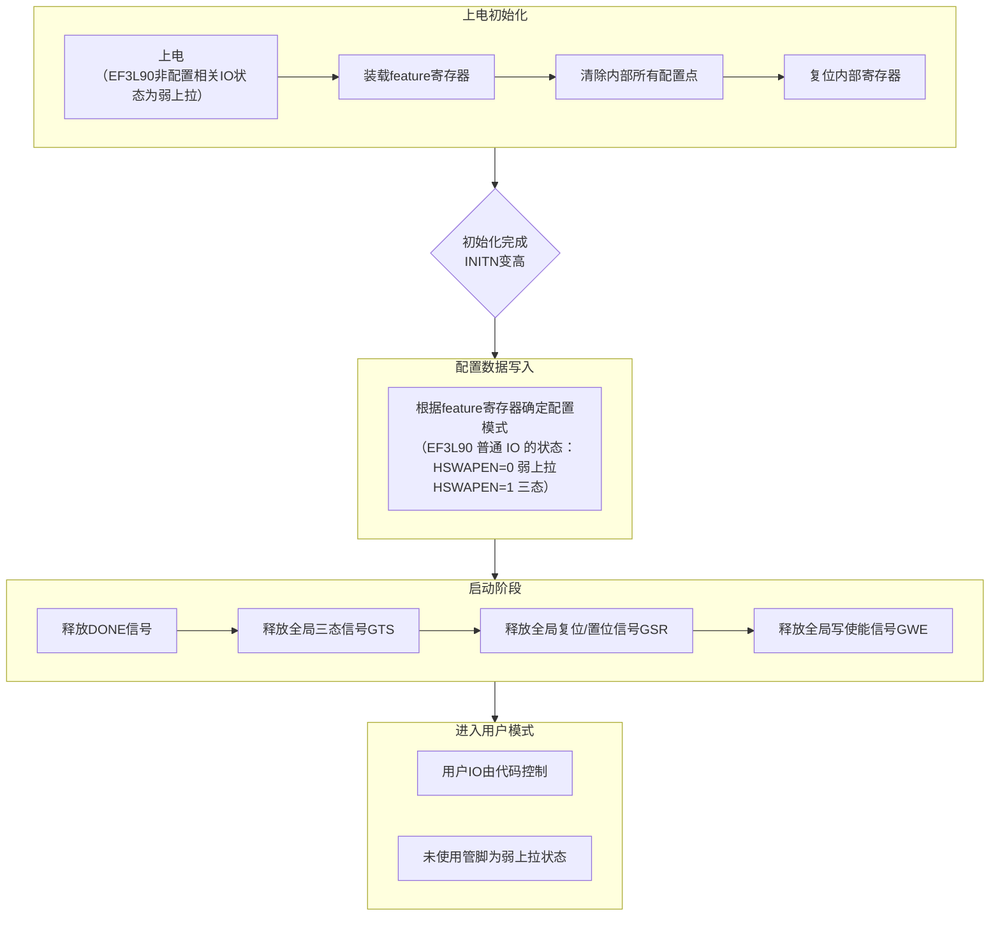

概要：本文详细介绍了 Anlogic EF3 系列 FPGA 上电后的配置流程，包括上电初始化、配置数据写入、启动阶段及进入用户模式的详细过程，同时提供了配置信号状态控制的说明及 MSPI 配置流程图示。  

## 1. 基本流程

上电初始化 → 配置数据写入 → 启动阶段 → 进入用户模式

---

## 2. 基本流程详解

### 2.1 上电初始化

上电后，系统进入初始化阶段，依次完成以下操作：

- 装载 feature 寄存器
- 清除内部所有配置点
- 复位内部寄存器

> PS：非配置相关 I/O 在 feature 寄存器加载前的状态如下：

| 器件                   | VERSION | 非配置相关 I/O 状态（feature寄存器加载前） |
| :--------------------- | :------ | :------------------------------------------ |
| EF3L40, EF3L90         | -       | 弱上拉                                      |
| EF3LA0, EF3L50, EF3L70 | 3'b000  | 三态                                        |
| EF3LA0, EF3L50, EF3L70 | 3'b010  | 弱下拉                                      |

初始化完成后，`INITN` 信号变为高电平，系统进入配置数据写入阶段。

---

### 2.2 配置数据写入

根据 feature 寄存器决定加载数据的配置模式：

- **EF3L40 和 EF3L90**：普通 I/O 状态由 `HSWAPEN` 控制  
  - HSWAPEN = 0：弱上拉  
  - HSWAPEN = 1：三态

- **EF3LA0、EF3L70、EF3L50**：普通 I/O 状态由 `HSWAPEN` 控制  
  - HSWAPEN = 0：弱下拉
  - HSWAPEN = 1：三态

---

### 2.3 启动阶段

完成配置数据写入后，依次释放各类控制信号：

1. **释放 DONE 信号**  
   - DONE 从低电平变为高电平，表示 FPGA 完成数据配置。

2. **释放 GTS（全局三态信号）**  
   - 控制释放所有 I/O 管脚，使其恢复功能。

3. **释放 GSR（全局复位/置位信号）**  
   - 允许所有触发器根据代码逻辑改变状态。

4. **释放 GWE（全局写使能信号）**  
   - 允许所有 RAM 和触发器写入。

---

### 2.4 进入用户模式

进入用户模式后：

- 用户使用的 IO 脚由代码控制
- 未使用的管脚保持弱上拉状态

---

## 3. MSPI 配置流程

