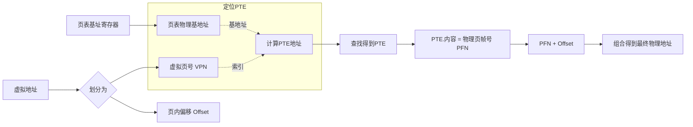
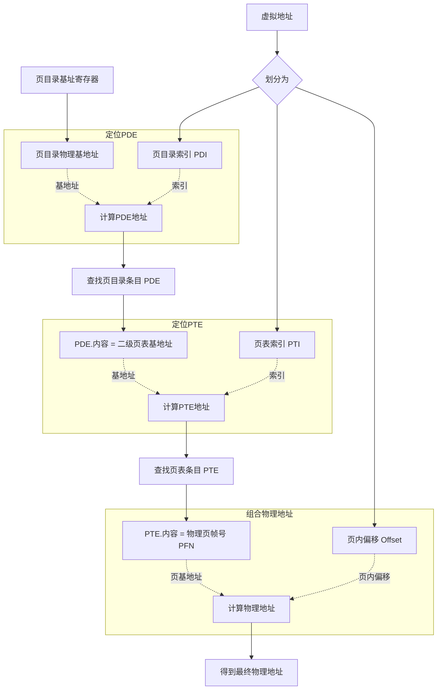

概要：对比单级页表与多级页表：单级页表的结构与内存浪费问题，多级页表按需分配节省空间的设计，以及两种页表下 MMU 查询物理地址的完整步骤与流程图。

## 1 页表在内存中必须是顺序且连续存储的

1. MMU查表的时候，是根据进程要求的虚拟地址，去页表中查询对应的物理地址的。
2. 可以想象一个数组，虚拟地址是数组的下标，而每个数组元素中存储了该虚拟地址对应的物理地址。
3. 虚拟地址是有序的，而指向的物理地址可以是乱序的。
4. 虚拟地址的有序，是为了达到O(1)查找的效果。

## 2 页表结构

### 2.1 单级页表的结构

指整个地址翻译过程中**只有一张页表**。这是最基础的分页模型。

- **结构**：一个连续的线性表，每个条目直接存储虚拟页号到物理页帧号的映射，以及权限位等控制信息。
- **查询**：CPU使用虚拟地址的**页号部分**作为索引，直接在这张唯一的页表中查找，找到对应的页表条目后，与页内偏移组合得到物理地址。
- **核心问题**：
  - **内存浪费**：页表必须覆盖整个虚拟地址空间。例如，32位系统（4GB虚拟空间）使用4KB页，需要2^20（约100万）个条目。即使进程只使用很小一部分内存，页表也必须完整存在，占用大量物理内存。
  - **扩展性差**：对于64位系统，单级页表的大小将是天文数字，完全不现实。

### 2.2 多级页表的结构（以二级为例）

为了解决单级页表的问题而引入的层次化结构。这里的“一级”和“二级”是**层级关系**。

- **一级页表（页目录）**：是多级页表系统中的**第一级**。它不直接映射物理页，而是映射到**二级页表**。
- **二级页表**：是多级页表系统中的**第二级**。它由一级页表的条目指向，负责管理一小块地址空间，其条目才最终映射到物理页帧。
- **核心优势**：
  - **节省内存**：只有进程实际使用的内存区域，才需要分配对应的二级页表。未使用区域的页目录条目可以标记为“不存在”，其对应的二级页表无需分配，从而极大减少了内存占用。
  - **支持巨大地址空间**：通过增加级数，可以高效管理64位等巨大的虚拟地址空间。

## 3 查询

### 3.1 单级页表查询

在单级页表系统中，整个地址空间只由一张页表映射。

- **地址划分**：MMU将虚拟地址视为两部分：
  - **虚拟页号**：高位部分，作为在**唯一页表**中查找的索引。
  - **页内偏移**：低位部分，用于在找到的物理页内定位字节。

- **查询步骤**：
  1.  **定位页表**：CPU从**页表基址寄存器**中获取当前进程的单级页表的物理基地址。
  2.  **查找条目**：使用虚拟地址中的**虚拟页号**作为索引，直接从该页表中定位对应的**页表条目**。
  3.  **获取物理地址**：从PTE中读取**物理页帧号**，与虚拟地址中的**页内偏移**直接组合，得到最终物理地址。

- **流程图**：

### 3.2 多级页表查询

在多级页表系统中，地址翻译是一个分层查找的过程。这里以经典的二级页表（页目录 + 页表）为例。

- **地址划分**：MMU将虚拟地址划分为三部分：
  - **页目录索引**：最高位部分，用于在第一级（页目录）中查找。
  - **页表索引**：中间部分，用于在第二级（页表）中查找。
  - **页内偏移**：最低位部分，用于在物理页内定位字节。

- **查询步骤**：
  1.  **定位页目录**：CPU从**页目录基址寄存器**中获取页目录的物理基地址。
  2.  **查找PDE**：用虚拟地址的**页目录索引**，在页目录中找到对应的**页目录条目**。PDE中存储了二级页表的物理基地址。
  3.  **查找PTE**：用虚拟地址的**页表索引**，在PDE指向的二级页表中，定位对应的**页表条目**。PTE中存储了目标物理页帧号。
  4.  **获取物理地址**：将PTE中的**物理页帧号**与**页内偏移**组合，得到最终物理地址。

- **流程图**：

